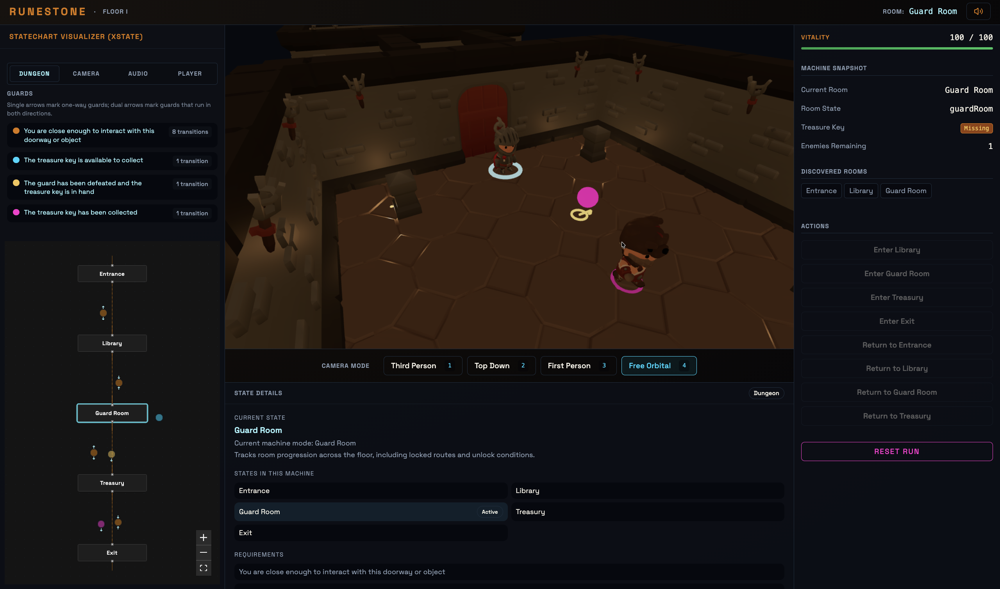
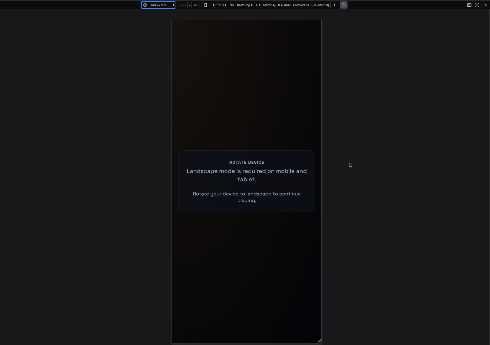
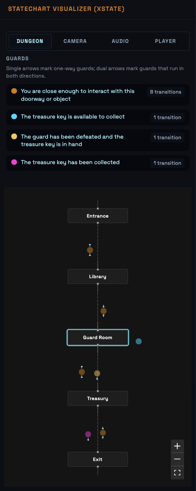

# Runestone

Runestone is a 3D dungeon crawler where the dungeon architecture is a live, running state machine.
Rooms are states, doors are transitions, rune-locked thresholds are guard conditions, and enemy
behaviour is driven by machine-managed runtime logic. A live inspector panel renders the state
graph while the player moves through the dungeon.

This is an engineering-first game prototype. The machine is not just in the code — it is the level.

**[🏰 Enter the Dungeon](https://runestone.teeldinho.com)**



---

## What is a Finite State Machine?

A **Finite State Machine (FSM)** is a computation model where a system can exist in exactly one
of a finite number of **states** at any moment. It moves between states through **transitions**,
which are triggered by events. Optional **guard conditions** can block a transition until a
required condition is met.

FSMs shine when behaviour is predictable and bounded. The model solves a common engineering problem: without explicit state representation, systems accumulate tangled conditionals, hidden edge cases, and transitions that are hard to trace or test. When state is made explicit, behaviour becomes visible, auditable, and testable.

---

## Why XState? (Enterprise & Senior Use Cases)

**XState** is a JavaScript/TypeScript library that implements statecharts — an extended form of
FSMs that adds hierarchy, parallelism, guards, context, and invoked actors to the base model.

While often introduced for simple component states, XState is heavily utilized in enterprise architectures to solve complex software engineering problems:

### 1. The Actor Model (XState v5)
XState v5 introduces a first-class actor model. Instead of one massive "God machine", systems are composed of isolated machines (actors) that communicate via explicit message passing. In a complex frontend, a checkout flow might spawn a dedicated payment validation actor, pausing its own execution until the child returns a success/failure output. In Runestone, enemies and separate rooms act as independent, orchestrated actors.

### 2. UI as a Strict "State Contract"
Fragile boolean flags (`isLoading`, `isError`, `isSuccess`) often lead to overlapping, invalid UI configurations (e.g., showing a loading spinner while rendering an error message). By modeling UI as an XState machine, impossible states are mathematically eliminated. The UI component is downgraded to a pure visual projection that simply reflects the current node of the machine (`state.value`).

### 3. Complex Orchestration & Sagas
For long-running processes (e.g., multi-step wizard registrations, distributed sagas across microservices, websockets), state machines ensure fault tolerance. They can elegantly handle timeouts, auto-retries, escalations, and debounces declaratively. 

### 4. Hierarchical and Orthogonal States
State machines easily model parallel activities (orthogonal states). For instance, a video player application can be in a `playing` state while simultaneously being in a `muted` state. Hierarchical (nested) states allow developers to group logic cleanly and avoid transition explosion (e.g., a "CANCEL" event handled uniformly by a parent state machine node).

### 5. Model-Based Testing (MBT)
Because the statechart defines all possible nodes and the explicit paths to reach them, QA and testing suites can automatically generate traversal graphs. Hundreds of robust End-to-End browser tests can be completely synthesized without manual scripting, simply by asking the engine to reach every state defined in the contract.


---

## How Runestone uses XState

Every concept in the game maps directly to an XState concept:

| XState Concept  | Runestone Equivalent                              |
| --------------- | ------------------------------------------------- |
| State           | Room (Entrance, Library, Guard Room, Treasury, Exit) |
| Transition      | Doorway / corridor between rooms                  |
| Guard condition | Rune-locked door (`hasKey`, `enemiesDefeated`)    |
| Context         | Inventory, HP, score, discovered rooms            |
| Entry action    | Audio cue, haptic feedback, scene update          |
| Invoked actor   | Enemy behaviour machine (patrol → detect → attack) |
| Final state     | Exit chamber — floor complete                     |

The machine is not an internal implementation detail hidden from the player. An inspector panel renders the dungeon graph in real time, and the rune-locked doors in the 3D world glow based on whether their guard conditions are met. 



---

## Project Summary

Phase 1 is a single-floor dungeon with five rooms:

```
Entrance → Library → Guard Room → Treasury → Exit
```

**Implemented systems:**
- 3D dungeon scene with KayKit environment assets and atmospheric fog
- Four camera modes: third-person, top-down, first-person, free-orbital
- Machine-authoritative room traversal with doorway-relative arrival
- Live XState inspector panel (React Flow + dagre layout)
- Player movement, collision physics (Rapier), health, death, and restart flow
- Guard-room enemy behaviour and treasury key progression
- Convex-backed authentication and leaderboard flow
- Audio (Tone.js) and haptics (Web Haptics API) integration
- Fully scalable HUD system with settings and interactive tutorials

### Mobile Responsiveness
Runestone ships with complete touch-screen compatibility, making the 3D physics-based dungeon crawler fully accessible on responsive devices:
- **Touch Input:** Integrated virtual joysticks for movement and touch-and-drag for orbital camera control.
- **Adaptive Layouts:** Distinct interfaces mapping strictly to Portrait and Landscape boundaries to preserve gameplay viewing angles.
- **Bottom-Sheet Flow:** The XState Inspector Sidebar and Settings gracefully map into Shadcn-powered bottom sheets and drawers, maximizing canvas estate.

<div style="display: flex; flex-wrap: wrap; gap: 10px; margin-bottom: 20px;">
  
  
  
</div>

---

## Why This Project Exists

Runestone is a practical experiment in making state-machine architecture tangible.

Most applications that use state machines keep the machine hidden — it runs in the background,
invisible to users and developers alike. Runestone inverts that: the machine is the level, the
level is the machine.

The questions driving the project:
- What happens when application state is also spatial structure?
- How do guards, actors, and transitions feel when they are physical and visible?
- Can a runtime inspector and a playable 3D world share one coherent source of truth?

Answering those questions in code, not theory, is the point. The architectural choices exist to
preserve that answer — not to add complexity for its own sake.

---

## Architecture

Runestone uses **Feature-Sliced Design (FSD)** — a methodology for organising front-end
codebases into layers where code can only import from layers below it.

FSD solves the problem of entangled imports in large applications. By enforcing a strict layer
hierarchy and requiring each slice to expose a public API, it ensures that modules stay
independently comprehensible, replaceable, and testable.

### Layers

| Layer       | Responsibility                                                     |
| ----------- | ------------------------------------------------------------------ |
| `app/`      | Providers, router, root wiring                                     |
| `pages/`    | Route-level screen composition                                     |
| `widgets/`  | Large page sections: game canvas, HUD, inspector panel             |
| `features/` | User-facing flows: camera, auth, audio, haptics, dungeon navigation |
| `entities/` | Core domain models: player, enemy, room, dungeon, score            |
| `shared/`   | Reusable UI primitives, config, types, and infrastructure          |

### Segment naming (within every slice)

| Segment    | Contains                                            |
| ---------- | --------------------------------------------------- |
| `ui/`      | React components — render only, zero logic          |
| `model/`   | Hooks and XState machines — orchestration           |
| `lib/`     | Pure functions — utilities, calculators, resolvers  |
| `config/`  | Static constants — no helper functions              |
| `api/`     | Backend integration — queries, mutations            |

### Data flow

Every slice follows a strict chain:

```
Component (ui/) → Hook (model/) → Utility (lib/) → Constant (config/)
```

Rendering, orchestration, pure logic, and constants are never mixed. This rule is enforced by automated purity checks that run on every commit.

---

## Engineering Approach

### Test-Driven Development (TDD)
**Test-Driven Development** is a practice where you write a failing test *before* writing the implementation it tests. The cycle is: write a failing test (Red), write just enough code to make it pass (Green), then refactor. Repeating this loop produces logic that is covered by design, not retro-fitted. 

Runestone applies TDD strictly to all `model/` and `lib/` segments, requiring **100% test coverage** before a PR can merge.

### Spec-Driven Development (SDD)
In Runestone, development starts from a written brief. Each work item operates inside a delivery loop: brief → spec → implement → verify → close. This guarantees all features map directly to acceptance criteria, drastically minimizing scope-creep and untracked bugs.

---

## Technical Decisions

### React 19 + R3F + Rapier
The project integrates modern paradigms across a 3D stack:
- **React 19** for the concurrent component topology.
- **React Three Fiber (v9)** to orchestrate 3D objects as a declarative tree.
- **@react-three/rapier (v2)** to bind real-time structural physics safely against the render loop.

### TanStack Start & Router
TanStack Start implements the application's file-based routing and SSR layout scaffolding, ensuring navigation remains entirely type-safe. The WebGL canvas runs purely client-side without hydration unmounts, while non-WebGl routes (Settings, Leaderboards) benefit from robust static layouts.

### Real-Time with Convex
Convex provides reactive data flow out of the box without the overhead of GraphQL subscriptions or web-socket polling. It serves as the primary data-authority for zero-friction user onboarding, session persistence, and instant-on leaderboards.

---

## Camera and Traversal

Runestone has four camera modes, each controlled by a hotkey (keys 1–4):

| Mode           | Hotkey | Behaviour                                              |
| -------------- | ------ | ------------------------------------------------------ |
| Third Person   | `1`    | Offset behind player, polar-constrained orbit          |
| Top Down       | `2`    | Fixed overhead angle, zoom only, pan locked            |
| First Person   | `3`    | Head-level view, pointer-lock, subtle head-bob         |
| Free Orbital   | `4`    | Full 6-DoF orbit, pan + rotate + zoom                  |

All transition logic relies on smooth lerping orchestrated by dedicated configuration constants in the codebase. 

<div style="display: flex; justify-content: space-between; margin-bottom: 20px;">
  
  
</div>

---

## Getting Started

### Prerequisites
- Node.js ≥ 22.12.0 (`.nvmrc` included — run `nvm use` to align)
- npm ≥ 11.5.1
- A [Convex](https://convex.dev) account (free tier sufficient)

### 1. Install dependencies

```bash
npm install
```

### 2. Configure Convex

```bash
npx convex dev --once
```

### 3. Start the development server

```bash
npm run dev
```

Open [http://localhost:3000](http://localhost:3000). On first visit, a username prompt appears. After entering a username, you land on the game page.

---

## Scripts

```bash
npm run dev           # Start dev server (TanStack Start + Convex)
npm run build         # Production build
npm run typecheck     # TypeScript — must produce zero errors
npm run lint          # Biome check (read-only)
npm run lint:fix      # Biome auto-fix
npm run lint:fsd      # Steiger FSD architecture validation
npm run lint:purity   # Segment purity checks (config/lib/ui separation)
npm run test          # Vitest test suite
npm run ci:local      # Full local CI parity check before pushing
```

---

## Final Note

Runestone is built as an engineering experiment with production-grade guardrails.
The goal is not to ship a commercial game — it is to explore what software looks like
when the state machine is the product, not the plumbing.

Every architectural decision traces back to that premise:
the dungeon you walk through and the machine you inspect are the same thing.
