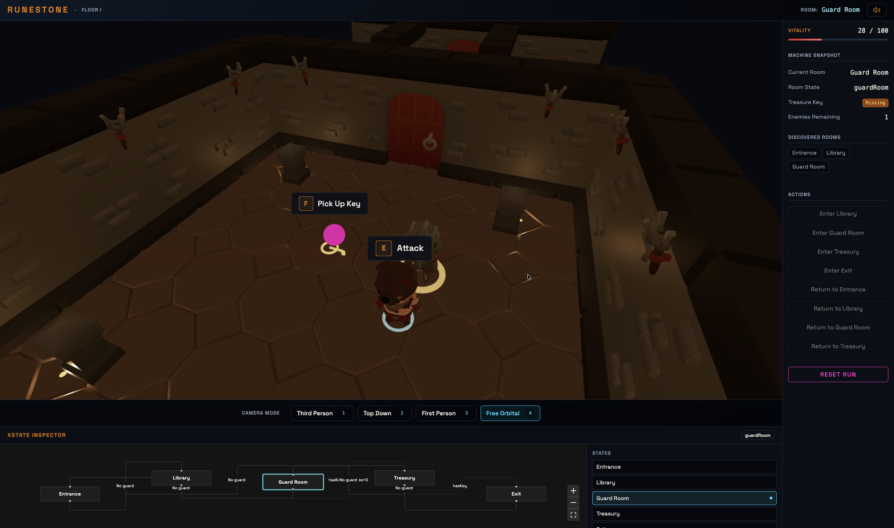

# Runestone

Runestone is a 3D dungeon crawler where the dungeon architecture is a live, running state machine.
Rooms are states, doors are transitions, rune-locked thresholds are guard conditions, and enemy
behaviour is driven by machine-managed runtime logic. A live inspector panel renders the state
graph while the player moves through the dungeon.

This is an engineering-first game prototype. The machine is not just in the code — it is the level.

**Live:** [runestone.teeldinho.com](https://runestone.teeldinho.com)



---

## What is a Finite State Machine?

A **Finite State Machine (FSM)** is a computation model where a system can exist in exactly one
of a finite number of **states** at any moment. It moves between states through **transitions**,
which are triggered by events. Optional **guard conditions** can block a transition until a
required condition is met.

FSMs shine when behaviour is predictable and bounded:

- A traffic light cycles through Red → Green → Yellow → Red
- A loading screen is either `idle`, `fetching`, `success`, or `error`
- A game character is either `idle`, `walking`, `attacking`, or `dead`

The model solves a common engineering problem: without explicit state representation, systems
accumulate tangled conditionals, hidden edge cases, and transitions that are hard to trace or
test. When state is made explicit, behaviour becomes visible, auditable, and testable.

---

## Why XState?

**XState** is a JavaScript/TypeScript library that implements statecharts — an extended form of
FSMs that adds hierarchy, parallelism, guards, context, and invoked actors to the base model.

Where a plain FSM describes *which* states exist and *how* transitions fire, XState adds:

- **Guards** — conditional gates on transitions (`hasKey`, `enemiesRemaining`)
- **Context** — structured data carried by the machine (inventory, score, health)
- **Actors** — independently running machines invoked by a parent machine (enemy behaviour)
- **Entry/exit actions** — side effects that run when entering or leaving a state
- **Inspectable runtime** — the machine's current state can be read and visualised externally

XState v5 (used in this project) introduces a first-class actor model with explicit lifecycle
management, input/output contracts, and a `setup()` API that declares the machine's full
interface before implementation.

### How Runestone uses XState

Every concept in the game maps directly to an XState concept:

| XState Concept  | Runestone Equivalent                              |
| --------------- | ------------------------------------------------- |
| State           | Room (Entrance, Library, Guard Room, Treasury, Exit) |
| Transition      | Doorway / corridor between rooms                  |
| Guard condition | Rune-locked door (`hasKey`, `enemiesDefeated`)    |
| Context         | Inventory, HP, score, discovered rooms            |
| Entry action    | Audio cue, haptic feedback, scene update          |
| Invoked actor   | Enemy behaviour machine (patrol → detect → attack) |
| Final state     | Exit chamber — floor complete                     |

The machine is not an internal implementation detail hidden from the player. An inspector panel
renders the dungeon graph in real time. The rune-locked doors in the 3D world glow based on
whether their guard conditions are met. The game world and the state machine are the same
structure, observed from two directions.

---

## Project Summary

Phase 1 is a single-floor dungeon with five rooms:

```
Entrance → Library → Guard Room → Treasury → Exit
```

The player explores the floor using Rapier physics and four camera modes while the dungeon
machine orchestrates traversal, guards, enemy behaviour, and state visibility.

**Implemented systems:**
- 3D dungeon scene with KayKit environment assets and atmospheric fog
- Four camera modes: third-person, top-down, first-person, free-orbital
- Machine-authoritative room traversal with doorway-relative arrival
- Live XState inspector panel (React Flow + dagre layout)
- Player movement (WASD, sprint), health, death, and restart flow
- Guard-room enemy behaviour and treasury key progression
- Convex-backed authentication and leaderboard flow
- Audio (Tone.js) and haptics (Web Haptics API) integration
- Achievements, HUD, settings, and tutorial systems

> **Active development.** Phase 1 targets desktop-first gameplay. Mobile controls
> (virtual joystick, touch input) are deferred to Phase 2.

---

## Why This Project Exists

Runestone is a practical experiment in making state-machine architecture tangible.

Most applications that use state machines keep the machine hidden — it runs in the background,
invisible to users and developers alike. Runestone inverts that: the machine is the level, the
level is the machine.

The questions driving the project:

- What happens when application state is also spatial structure?
- How do guards, actors, and transitions feel when they are physical and visible?
- Can a runtime inspector and a playable 3D world share one coherent source of truth?

Answering those questions in code, not theory, is the point. The architectural choices exist to
preserve that answer — not to add complexity for its own sake.

---

## Architecture

Runestone uses **Feature-Sliced Design (FSD)** — a methodology for organising front-end
codebases into layers where code can only import from layers below it.

FSD solves the problem of entangled imports in large applications. By enforcing a strict layer
hierarchy and requiring each slice to expose a public API, it ensures that modules stay
independently comprehensible, replaceable, and testable.

### Layers

| Layer       | Responsibility                                                     |
| ----------- | ------------------------------------------------------------------ |
| `app/`      | Providers, router, root wiring                                     |
| `pages/`    | Route-level screen composition                                     |
| `widgets/`  | Large page sections: game canvas, HUD, inspector panel             |
| `features/` | User-facing flows: camera, auth, audio, haptics, dungeon navigation |
| `entities/` | Core domain models: player, enemy, room, dungeon, score            |
| `shared/`   | Reusable UI primitives, config, types, and infrastructure          |

### Segment naming (within every slice)

| Segment    | Contains                                            |
| ---------- | --------------------------------------------------- |
| `ui/`      | React components — render only, zero logic          |
| `model/`   | Hooks and XState machines — orchestration           |
| `lib/`     | Pure functions — utilities, calculators, resolvers  |
| `config/`  | Static constants — no helper functions              |
| `api/`     | Backend integration — queries, mutations            |

### Data flow

Every slice follows a strict chain:

```
Component (ui/) → Hook (model/) → Utility (lib/) → Constant (config/)
```

Rendering, orchestration, pure logic, and constants are never mixed. This rule is enforced by
automated purity checks that run on every commit.

---

## Engineering Approach

### Test-Driven Development (TDD)

**Test-Driven Development** is a practice where you write a failing test *before* writing the
implementation it tests. The cycle is: write a failing test (Red), write just enough code to
make it pass (Green), then refactor. Repeating this loop produces logic that is covered by
design, not retro-fitted.

TDD matters most for code that is hardest to debug visually — orchestration logic, pure
calculators, interaction resolvers, and state machine transitions. Runestone applies TDD to all
`model/` and `lib/` work, requiring 100% coverage on those segments before a PR can merge.

### Spec-Driven Development (SDD)

**Spec-Driven Development** means implementation starts from a written brief, not from a vague
intent. Each work item begins as an explicit specification: what the outcome is, what acceptance
criteria it must satisfy, and what evidence confirms it is done.

In practice this means:

- No work starts without a written scope
- Each scope is broken into narrow, verifiable slices
- Each slice has pass/fail criteria before the first line of code is written
- Every change is reviewed against the spec, not just against itself

For Runestone, this is operationalised through a controlled delivery loop: brief → spec →
implement → verify → close. This keeps individual changes small, traceable, and low-risk, even
for a complex multi-system project.

This loop is inspired in part by iterative delivery patterns from formal software methods —
adapted here as a practical working discipline for an engineering-first project.

### Branch protection and PR-only delivery

- `develop` is the integration branch — PRs only, never direct commits
- `main` is the production branch — release PRs from `develop` only
- Every feature lives on its own short-lived branch
- Quality gates run before every commit and push

---

## Technical Decisions

### XState as runtime authority

XState owns discrete interaction and traversal authority. It does **not** own per-frame
physics, rigid-body transforms, animation blending, or camera lerp.

That split is deliberate:
- Machine logic handles room state, transition guards, interaction semantics, and orchestration
- Per-frame systems stay in render/runtime code where they belong

XState's context carries the inventory, health, discovered rooms, and score. The machine's
snapshot can be serialised and restored — which is groundwork for Phase 2 save slots.

### React 19 + R3F + Rapier

The project uses:
- **React 19** for the component and concurrency model
- **React Three Fiber (R3F) v9** for the declarative 3D scene
- **@react-three/rapier v2** for physics (required for React 19 + R3F v9 compatibility)
- **@react-three/drei** for camera controls, GLTF loaders, HTML projection, and helpers
- **@react-three/postprocessing** for optional bloom and vignette effects


### TanStack Start for the application layer

TanStack Start handles routing, server functions, and full-stack type safety. The game route
runs with `ssr: false` (client-only rendering required for WebGL). Other routes — leaderboard,
settings, tutorial — benefit from server-side rendering (SSR) for performance.

### Convex for backend state

Convex handles:
- User creation and identity via UUID-based zero-friction onboarding
- Score submission and leaderboard queries (reactive, real-time push)
- Save slot schema (groundwork for Phase 2 game progress persistence)

Frontend state consumption uses TanStack Query with `convexQuery()` from
`@convex-dev/react-query`. Queries use `staleTime: Infinity` — Convex pushes updates
reactively, so client-side polling is never needed.

### Audio: Tone.js

Tone.js drives looping background music via the Web Audio API Transport. The audio system is
wrapped in an XState audio machine and exposed through a single hook. Tone.js references stay
contained to the audio feature slice.

### Haptics

Haptic feedback fires on meaningful game events — room entry, guard failure, key pickup, enemy
defeat, floor completion. The implementation handles both Android Chrome and iOS Safari from
a single code path. Like audio, the haptics library is imported in exactly one file; all other
code uses semantic game-event functions exported from the haptics feature's public API.

### Styling: Tailwind v4 + Shadcn

Tailwind v4 is configured via the `@tailwindcss/vite` plugin — no PostCSS config needed.
Shadcn components live in `shared/ui/` and serve as the design-system primitive layer.
Custom variants use Class Variance Authority (CVA). The `cn()` utility lives in exactly one
file: `shared/lib/cn.ts`.

### Quality tooling

| Tool         | Enforces                                           | When it runs         |
| ------------ | -------------------------------------------------- | -------------------- |
| **Biome**    | Formatting + linting (replaces ESLint + Prettier)  | Pre-commit, CI       |
| **Steiger**  | FSD layer boundary enforcement                     | Pre-push, CI         |
| **Lefthook** | Git hook orchestration                             | Pre-commit, pre-push |
| **Vitest**   | Tests + coverage (80% overall, 100% model/ + lib/) | Pre-push, CI         |
| **tsc**      | TypeScript strict mode — zero errors allowed       | Pre-push, CI         |

---

## Layout

The game page has three regions:

- **Header** — title, current room name, mute toggle
- **Left column** — 3D scene fills the upper portion; the Statechart Visualizer (XState) panel sits below it, always visible; the camera mode switcher strip sits between the two
- **Right sidebar** — HUD with health, score, discovered rooms, action buttons, and game state

The Statechart Visualizer (XState) panel renders machines as live React Flow graphs. It shows each room as a
node (highlighted when active), every transition as an edge, and guard conditions labelled
inline. A metadata panel alongside the graph lists states, guard keys, and transitions in
text form.

The machine definitions that render in the visualizer are the same definitions used by runtime
actors — not duplicated static graph snapshots.

---

## Camera and Traversal

Runestone has four camera modes, each controlled by a hotkey (keys 1–4):

| Mode           | Hotkey | Behaviour                                              |
| -------------- | ------ | ------------------------------------------------------ |
| Third Person   | `1`    | Offset behind player, polar-constrained orbit          |
| Top Down       | `2`    | Fixed overhead angle, zoom only, pan locked            |
| First Person   | `3`    | Head-level view, pointer-lock, subtle head-bob         |
| Free Orbital   | `4`    | Full 6-DoF orbit, pan + rotate + zoom                  |

All FOVs, offsets, lerp speeds, and zoom ranges come from `CAMERA_CONFIG` constants — no
magic numbers in camera components. Mode transitions fire a haptic pulse. Free orbital renders
floating state-name labels above each room.

Room traversal is machine-authoritative: the dungeon machine transitions first, then the scene
positions the player relative to the correct doorway. There is no predictive movement or
client-side shortcutting.

---

## Backend and Persistence

### Convex schema

Three tables:

- **users** — `uuid`, `username`, `discriminator`, timestamps
- **dungeon_runs** — `userId`, `score`, `timeMs`, `roomsDiscovered`, `completedAt`
- **game_progress** — `userId`, `slot`, `snapshot` (XState JSON), `savedAt`

`game_progress` is schema-ready for Phase 2 save/load but is not yet wired to UI.

### Auth flow

First visit:
1. No UUID in `localStorage` → `crypto.randomUUID()` → stored
2. Username modal shown (3–20 alphanumeric characters)
3. Convex `createOrGet` mutation assigns a discriminator (e.g. `Hero#0023`)
4. Session stored → navigate to `/game`

Return visit: UUID found → `getByUuid` query → modal skipped.

---

## Tech Stack

| Category         | Technology                              |
| ---------------- | --------------------------------------- |
| Framework        | TanStack Start                          |
| Routing          | TanStack Router                         |
| UI               | React 19                                |
| 3D rendering     | React Three Fiber                       |
| 3D helpers       | @react-three/drei                       |
| Physics          | @react-three/rapier                     |
| Postprocessing   | @react-three/postprocessing             |
| State machines   | XState v5                               |
| 3D library       | Three.js                                |
| Graph layout     | @dagrejs/dagre                          |
| Flow graph       | @xyflow/react                           |
| Backend          | Convex                                  |
| Data fetching    | TanStack Query                          |
| Forms            | TanStack Form                           |
| Music            | Tone.js                                 |
| Haptics          | web-haptics                             |
| Animation        | Motion (motion/react)                   |
| Styling          | Tailwind CSS v4                         |
| UI primitives    | Shadcn + Radix UI                       |
| Variants         | Class Variance Authority                |
| Linting          | Biome                                   |
| Architecture     | Steiger (FSD enforcement)               |
| Git hooks        | Lefthook                                |
| Testing          | Vitest + Testing Library                |
| Language         | TypeScript (strict)                     |
| Runtime          | Node.js ≥ 22.12.0                       |

---

## Current Status

Phase 1 (single-floor MVP) is complete:

- All 5 rooms traversable with physics and collision
- Machine-authoritative traversal with guard conditions enforced
- Four working camera modes with smooth transitions
- Enemy patrol, detection, chase, and defeat in the guard room
- Key pickup, treasury door unlock, and floor completion
- Convex-backed auth, leaderboard, and score submission
- Achievements, HUD, audio, haptics, and settings

**Deferred for Phase 2:**

- Mobile controls (virtual joystick, touch input) — not yet implemented
- Responsive/mobile UX — game input currently requires keyboard and mouse
- Save/load system — Convex schema exists; UI not wired
- Multiple floors — only Floor One is scoped
- Advanced combat — enemy damage to player is placeholder
- Character facing direction and attack animations
- Visual polish: door open/close animations, prompt sizing at distance

---

## Getting Started

### Prerequisites

- Node.js ≥ 22.12.0 (`.nvmrc` included — run `nvm use` to align)
- npm ≥ 11.5.1
- A [Convex](https://convex.dev) account (free tier sufficient)

### 1. Install dependencies

```bash
npm install
```

### 2. Configure Convex

```bash
npx convex dev --once
```

This prompts you to log in and creates a `.env.local` file with your Convex deployment URL.

### 3. Start the development server

```bash
npm run dev
```

Open [http://localhost:3000](http://localhost:3000). On first visit, a username prompt appears.
After entering a username, you land on the game page.

---

## Scripts

```bash
npm run dev           # Start dev server (TanStack Start + Convex)
npm run build         # Production build
npm run typecheck     # TypeScript — must produce zero errors
npm run lint          # Biome check (read-only)
npm run lint:fix      # Biome auto-fix
npm run lint:fsd      # Steiger FSD architecture validation
npm run lint:purity   # Segment purity checks (config/lib/ui separation)
npm run test          # Vitest test suite
npm run ci:local      # Full local CI parity check before pushing
```

---

## Roadmap

**Phase 1 — Complete**
- Single-floor dungeon with five rooms
- Machine-authoritative traversal and guard conditions
- Enemy behaviour, key progression, achievements
- Live XState inspector panel
- Auth, audio, haptics, settings

**Phase 2 — Planned**
- Mobile controls: virtual joystick and touch input
- Multiple floors with progressive dungeon generation
- Save/load system using Convex game progress slots
- Advanced combat: player attack animations, enemy damage, health items
- Parallel states: twin chambers (XState parallel regions)
- Nested machines: sub-vaults via descending staircases
- Visual leaderboard

---

## Final Note

Runestone is built as an engineering experiment with production-grade guardrails.
The goal is not to ship a commercial game — it is to explore what software looks like
when the state machine is the product, not the plumbing.

Every architectural decision traces back to that premise:
the dungeon you walk through and the machine you inspect are the same thing.
