# Runestone

Runestone is a 3D exploration of **manifest logic**: a conceptual sandbox that transforms Finite State Machines (FSMs) into a navigable, interactive world. Rooms represent discrete states, corridors represent explicit transitions, and progression is governed by guards, context, and actor-driven loops rather than hidden control flow.

The project is intentionally both **playable** and **architectural**. It demonstrates how event-driven systems, statecharts, physics layers, autonomous-grade quality gates, and real-time 3D interaction can collaborate cleanly. The result is a spatial canvas that doubles as a visual argument for deliberate, deterministic software design.

**[🏰 Enter the Dungeon - Play Now!](https://runestone.teeldinho.com)**


---

## Executable Logic as Physical Space

Runestone maps formal statechart components directly to spatial game structures. By treating the physical geography as the authoritative representation of code logic, the application removes the layer of abstraction between system states and user perception:

| Statechart Construct | Spatial / Interactive Manifestation |
| :--- | :--- |
| **System State** | Discrete architectural chambers (Entrance, Library, Guard Room, Treasury, Exit) |
| **Transition Edge** | Physical corridors and locked door thresholds connecting chambers |
| **Transition Guard** | Runes, keys, and spatial requirements (e.g., clearing chamber guardians) |
| **Machine Context** | Dynamic coordinate registries, inventory payloads, and telemetry logs |
| **Entry Action** | Spatial audio cues, haptic impulses, and camera perspective transformations |
| **Concurrent Actor** | Autonomous guardian statecharts operating on independent event loops |
| **Final State** | The terminal chamber triggering systemic completion |

---

## Timeless Paradigms: Why Formal Statecharts Matter

In modern software development, representing complex state transitions through scattered booleans, flags, and nested conditionals inevitably leads to unpredictable race conditions and unmaintainable code structures. Statecharts solve this by formalizing transitions, exhaustively defining boundaries, and guaranteeing determinism. 

While Runestone explores these paradigms inside a 3D interface, identical event-driven actor loops govern the industry's most critical systems:

### Aerospace Avionics and Mission Control
In mission-critical environments under strict physical and temporal constraints, subsystem failure is not an option. Aerospace control systems utilize formal statecharts to catalog every possible transition under normal and anomalous operations. This exhaustiveness guarantees that autonomous fault detection, isolation, and recovery systems can return flight hardware to a stable operational branch without manual intervention.

### Edge Computing and Isolated Actors
Synchronizing distributed collaborative states without database locking bottlenecks is a major scale challenge. Modern serverless platforms resolve this by modeling edge instances as isolated, message-passing actors that process transitions sequentially. Since each actor governs its own state transitions deterministically, race conditions are mathematically eliminated at the network edge.

### Distributed Consensus Protocols
Fault-tolerant consensus engines rely on strict Finite State Machines to coordinate states across a clusters of nodes. Nodes transition between leader, follower, and candidate roles dynamically based on heartbeat durations and election timeouts, ensuring data integrity and split-brain prevention without centralized coordinate authority.

### Transactional Saga Orchestration
When business processes span multiple isolated databases or microservices, failure is an expected state. Transactional sagas utilize centralized statechart orchestrators to coordinate multi-stage tasks. If any microservice fails, the orchestrator triggers explicit compensating transitions to roll back previous actions and return the entire distributed ecosystem to a consistent state.

### Low-Latency Network Socket Lifecycles
Bidirectional client-server protocols (such as WebSockets or Server-Sent Events) demand high connection hygiene. Modeling the channel lifecycle (connecting, authenticating, active, backing-off, and terminating) within a statechart ensures that the interface and the network sockets remain in exact synchronization, eliminating socket leaks, zombie connections, and infinite retry loops.

### Collaborative Interactive Canvases
Vector design tools and collaborative editors treat user actions (clicks, drags, keyboard overrides) as advice-driven events routed to localized statechart controllers. This guarantees that complex behaviors, such as multi-pointer manipulation or nested state components, remain stable across multiple concurrent user sessions.

---

## The Concurrent Actor Loop Engine

Runestone is architected around the Actor Model. Every independent subsystem operates as a self-contained, event-driven loop that communicates solely through structured messages. This prevents concurrent subsystems from causing side effects in adjacent domains.

<div align="center">
  <figure>
    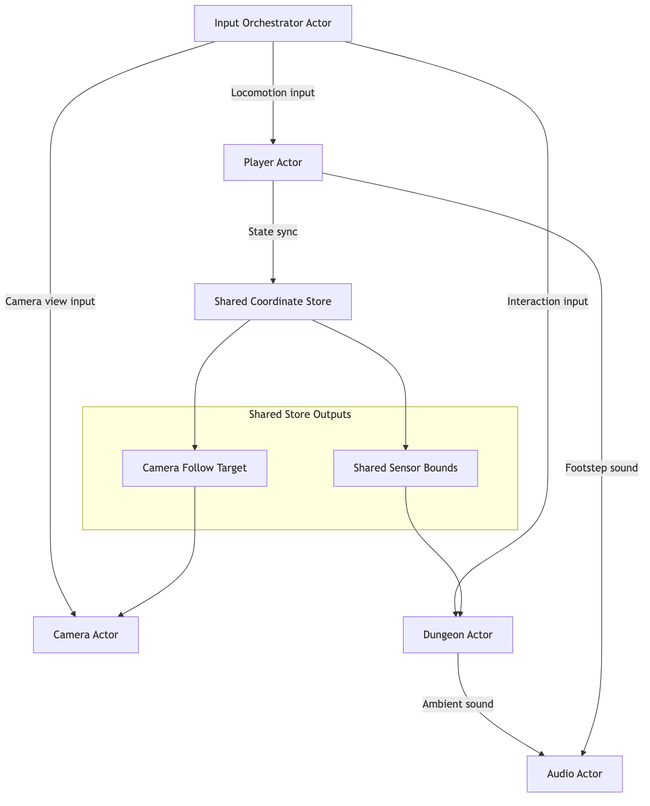
    <figcaption>The Concurrent Actor Loop Engine</figcaption>
  </figure>
</div>

### Spatial Layout: The Dungeon Actor
Governs the active configuration of the spatial layout. It controls room visibility boundaries, manages spatial transitions, and keeps door colliders active until all necessary transition guards (such as collecting room runes or defeating hostile actors) are satisfied.

<p align="center">
  
</p>

### Perspective Control: The Camera Actor
Manages the camera viewpoints—spanning Third-Person, Top-Down, First-Person, and Free Orbital views:
* **Discrete Transitions**: The camera FSM processes events to trigger perspective swaps and lock viewpoint boundaries.
* **Decoupled Continuous Sync**: High-frequency movements are managed by a custom orbit and follow-position utility layer that updates coordinates without feeding high-frequency camera controls back into the main state machine, preserving statechart determinism.
* **Angle Continuity**: Transitioning between perspectives preserves the active orientation vector of the camera, preventing disorientation during mode shifts.

<p align="center">
  
</p>

### Locomotion & Physiology: The Player Actor
Tracks locomotion mechanics (Idle, Walking, Running) and physical transitions (Grounded, Jumping, Falling) by reading spatial rigid-body colliders paired with ground sensors.

<p align="center">
  
</p>

### Unified Input Orchestration
Aggregates hardware keyboard events, pointer movement, and touch vectors into a single event-driven flow, converting raw hardware inputs into high-level events routed to adjacent actors.

<p align="center">
  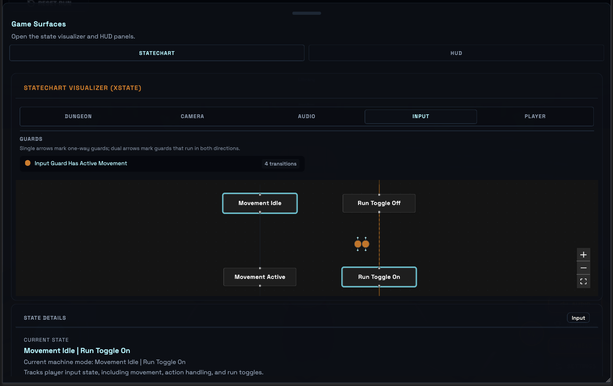
</p>

### Environmental Sound: The Audio Actor
Tracks the lifecycle of the audio environment through playing, paused, and muted transitions, serving as a single point for managing spatial volume transitions and persistence.

<p align="center">
  
</p>

---

## Spatial Debugging Interface & Visual Assets Tour

### 1. The Desktop Inspector Pane
The desktop layout features a responsive split-pane interface optimized for real-time analysis:
* **Left Pane**: Dynamic statechart graph renderer utilizing a custom orientation solver that lays out tree nodes vertically on desktop to fit narrow sidebar layouts perfectly.
* **Center Pane**: 3D WebGL viewport containing active rigid-body simulations, light fixtures, and chamber environments.
* **Right Pane**: State snapshot inspector showing active context variables, pending guards, and transition history logs.

<table>
  <tr>
    <td></td>
    <td>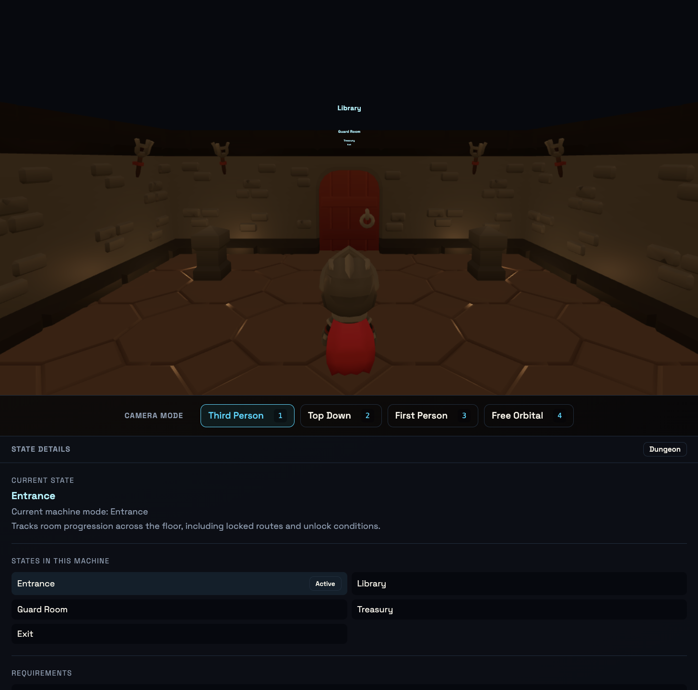</td>
    <td></td>
  </tr>
  <tr>
    <td align="center"><em>Visualizer: Live graph transitions</em></td>
    <td align="center"><em>Viewport: 3D canvas rendering</em></td>
    <td align="center"><em>Inspector: Active context parameters</em></td>
  </tr>
</table>

### 2. Camera Viewpoint Matrix
Viewpoint modes are governed by statechart transitions, combining direct look targets and clean orbital limits:

<table>
  <tr>
    <td>
      <h5>Third Person View:</h5>
      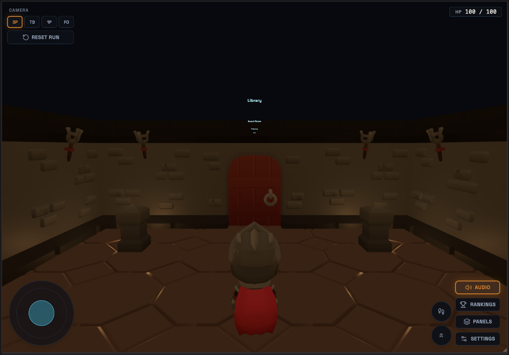
    </td>
    <td>
      <h5>Top Down View:</h5>
      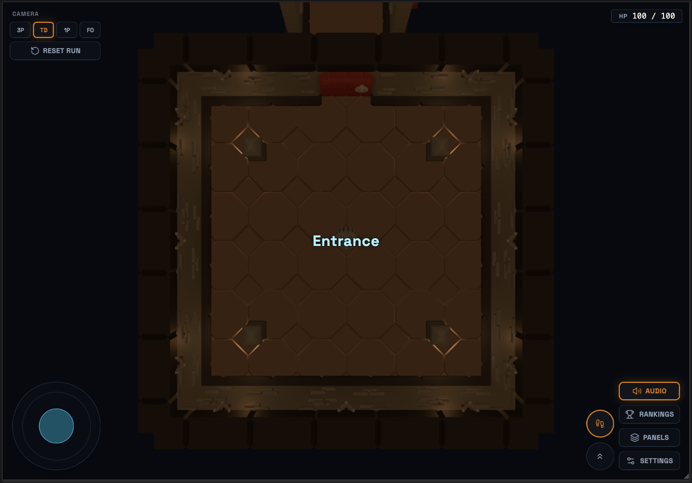
    </td>
  </tr>
  <tr>
    <td>
      <h5>First Person View:</h5>
      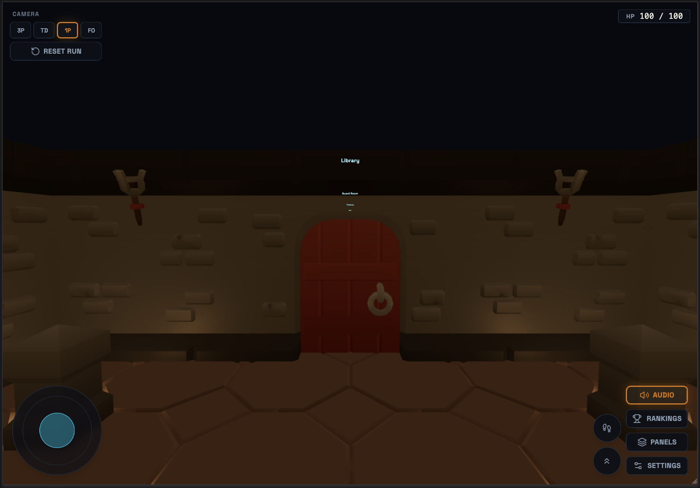
    </td>
    <td>
      <h5>Free Orbital View:</h5>
      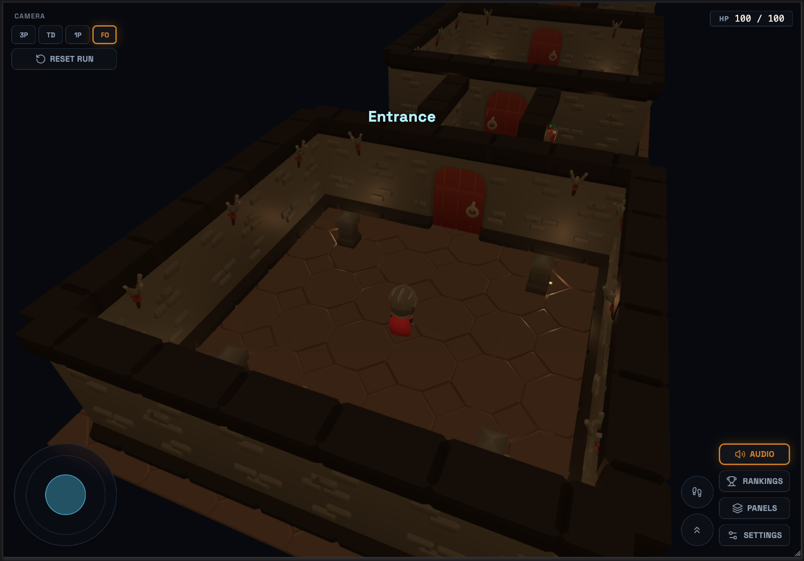
    </td>
  </tr>
</table>

### 3. Adaptive Mobile Layout
The interface optimizes touch boundaries for landscape devices:
* **Touch Locomotion**: A virtual joystick handles continuous movement vectors.
* **Action Toggles**: Dedicated controls manage run overrides and jump impulses.
* **Dynamic Re-orientation**: The left-hand statechart automatically shifts to a horizontal layout inside mobile bottom sheets, maximizing available vertical room.

<table>
  <tr>
    <td></td>
    <td>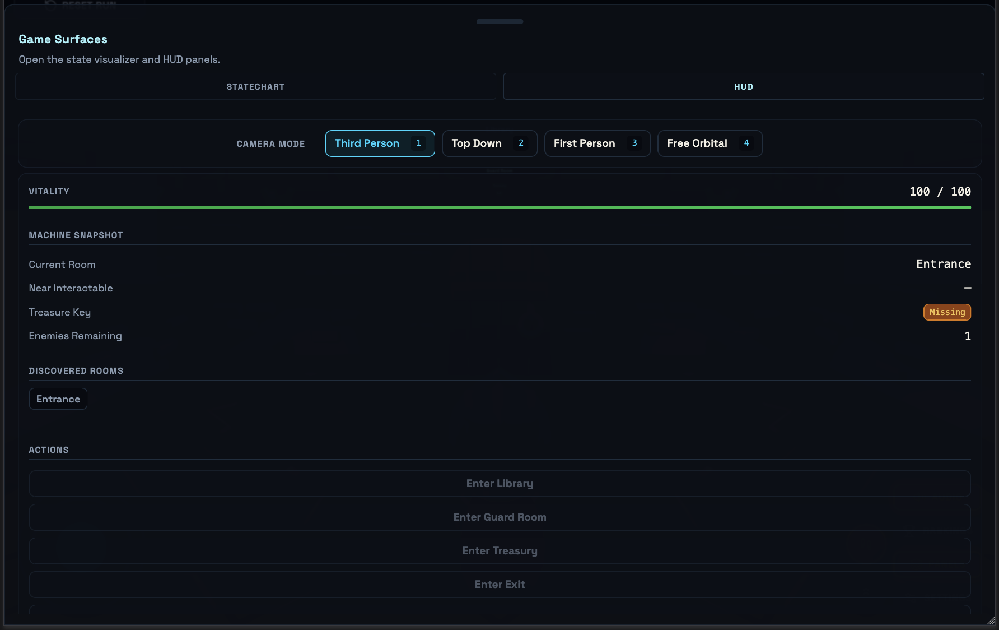</td>
  </tr>
  <tr>
    <td align="center"><em>Mobile HUD: Joystick and run overrides</em></td>
    <td align="center"><em>Mobile Sheet: Isolated vitality status tabs</em></td>
  </tr>
</table>

### 4. Interactive Combat & Deterministic Transitions
Interaction states model complex transitions based on environment events:

<table>
  <tr>
    <td>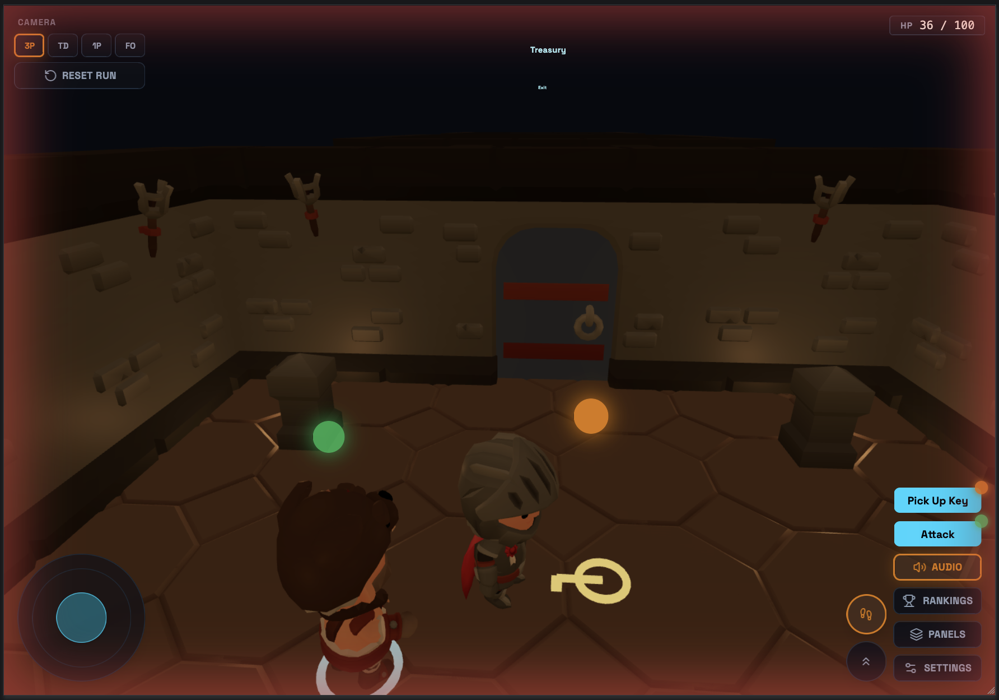</td>
    <td>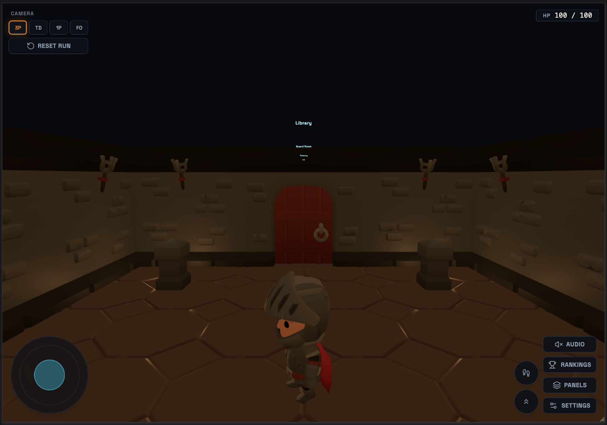</td>
  </tr>
  <tr>
    <td align="center"><em>Combat Loop: Hostile collision (Key dropped)</em></td>
    <td align="center"><em>Guard Met: Dynamic corridor door unlock</em></td>
  </tr>
</table>

When player vitality (HP) is reduced to `0`, the locomotion machine transitions to a terminal state, triggering a full-screen death vignette and a statechart-driven reset routine.

<p align="center">
  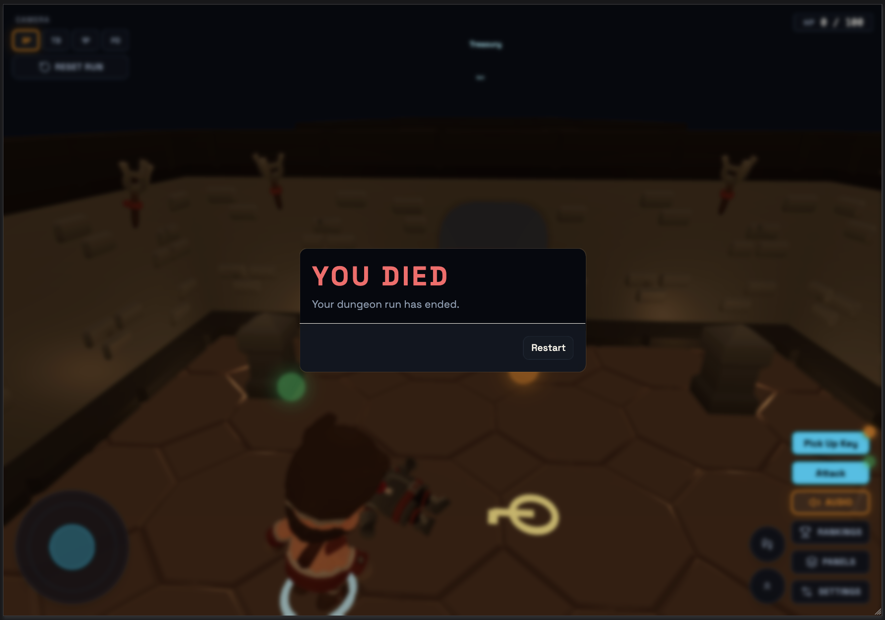
</p>

---

## Strict Quality Gates & AI-Native Engineering Discipline

Runestone is developed inside an AI-native engineering loop, where automated boundaries block regressions, preserve architecture layers, and enforce structural conventions. Both autonomous agent commits and developer contributions must pass through these quality gates before code integration can occur.

### The Two-Tier Verification Pipeline
Our quality validation operates across two layers: real-time in-editor diagnostics and blocking pre-commit git checks:

<div align="center">
  <figure>
    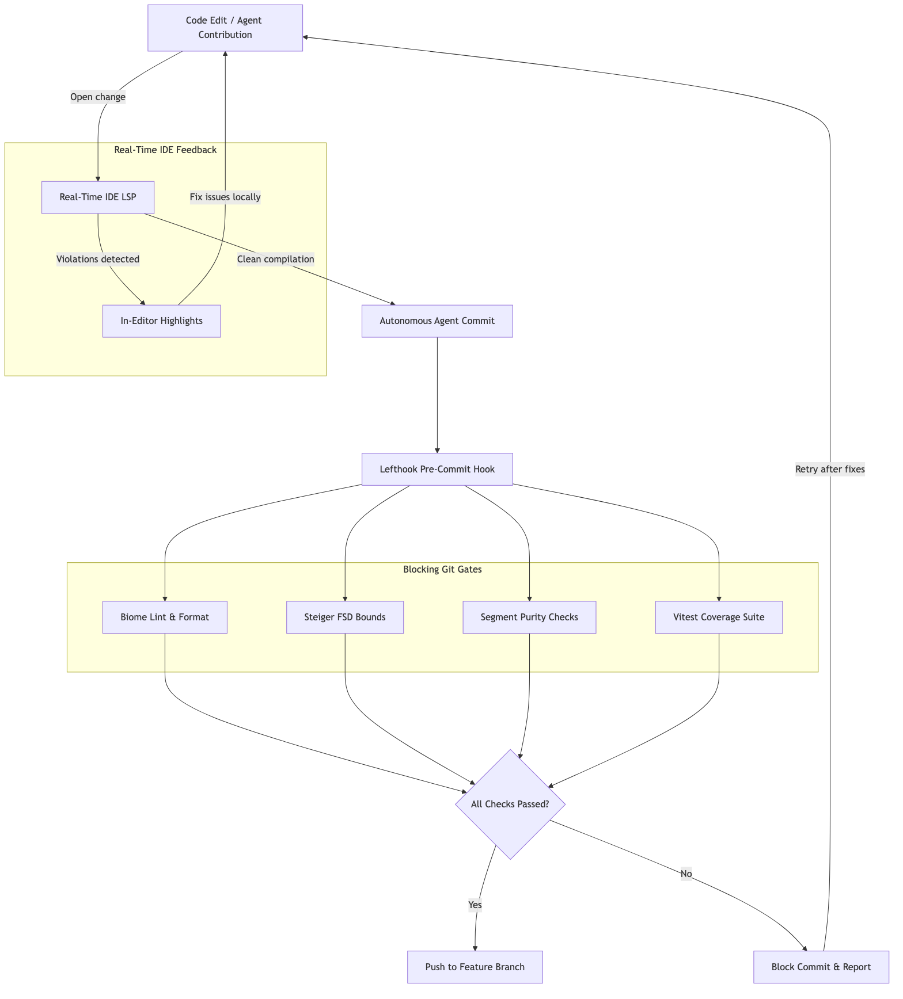
    <figcaption>The Two-Tier Verification Pipeline</figcaption>
  </figure>
</div>

### 1. Real-Time IDE Feedback (Language Server Protocol)
By running active Language Server Protocol (LSP) connections for TypeScript and Biome in the background of the editor, syntax warnings, formatting issues, type-mismatches, and Steiger Feature-Sliced Design boundary violations are instantly highlighted *during the editing process*. This shortens the feedback loop, allowing code issues to be corrected before a commit is even initiated.

### 2. Blocking Git Gates (Lefthook Orchestrator)
Once a commit is triggered, the Lefthook orchestrator executes four mandatory checkers:
* **Biome Static Analysis**: Audits and formats code in milliseconds to enforce strict formatting guidelines and prevent styling anti-patterns.
* **Steiger FSD Architectural Bounds**: Validates Feature-Sliced Design layers (`app -> pages -> widgets -> features -> entities -> shared`), blocking illegal circular dependencies and ensuring clean vertical slice separation.
* **Segment Purity Validator**: Enforces a strict separation of concerns, ensuring static data remain isolated in `config/` folders while functional utilities are placed exclusively in `lib/` modules.
* **Vitest Coverage Suite**: Automatically runs our 1,000+ unit and integration tests on every integration attempt to prevent structural regressions.

### Spec-Driven Development (SDD)
Before any subsystem is implemented, a comprehensive technical blueprint is created. This specification details exact scope boundaries, architectural constraints, edge cases, and expected acceptance metrics, guiding implementing agents and maintaining code integrity.

<p align="center">
  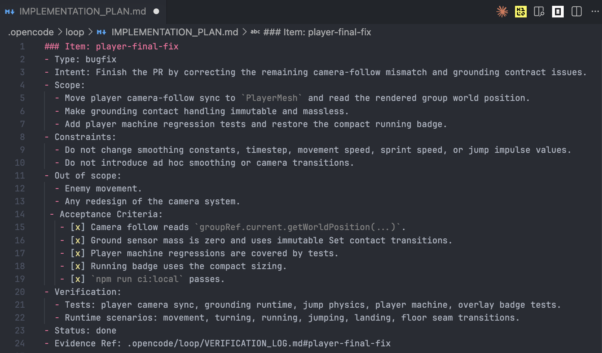
</p>

### Test-Driven Development (TDD)
We aim that no logic is added to `model/` or `lib/` segments without a corresponding failing test introduced beforehand. This forces the creation of highly decoupled modules and ensures that core business logic remains independent of UI rendering layers:

<table>
  <tr>
    <td>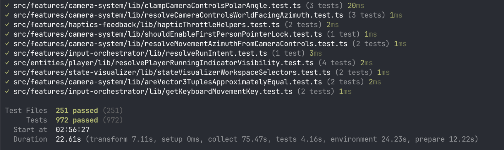</td>
    <td>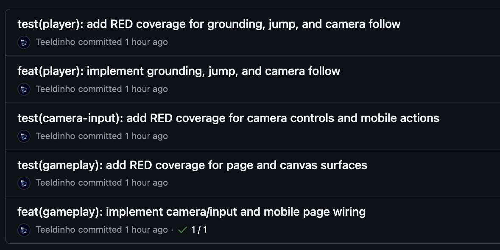</td>
  </tr>
  <tr>
    <td align="center"><em>TDD Suite: Testing isolated logical boundaries</em></td>
    <td align="center"><em>Commit Isolation: RED failing test commits precede GREEN implementation commits</em></td>
  </tr>
</table>

---

## Persistent Telemetry & Real-Time Sync

A self-hosted Convex node drives persistent telemetry log captures, real-time leaderboards, and user profiles:
* **End-to-End Type Safety**: Server schemas, mutations, and client queries share a single TypeScript compiler, preventing schema-mismatch bugs.
* **Real-Time Subscription Sync**: Telemetry logs and scoreboards update reactively via live subscriptions.

<table>
  <tr>
    <td>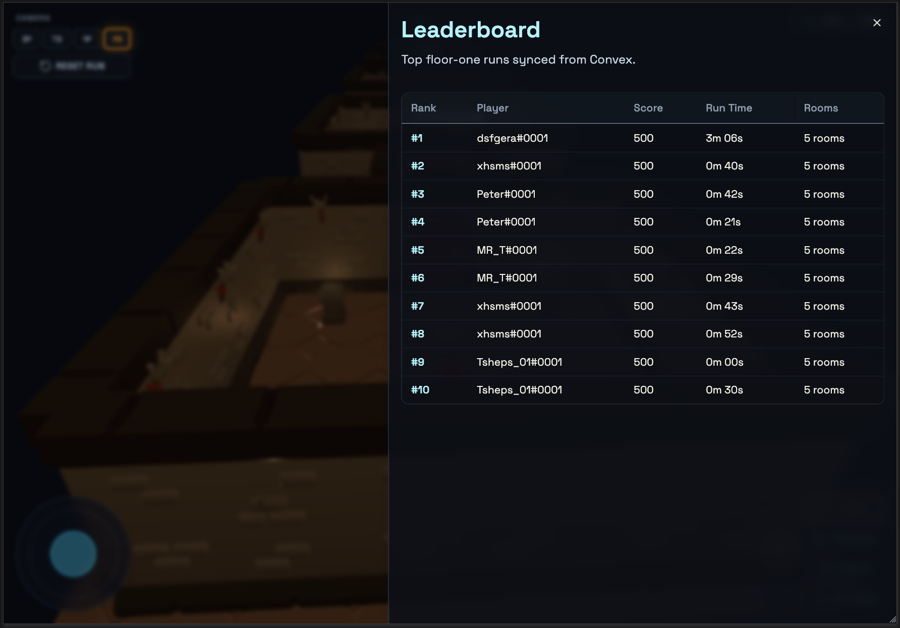</td>
    <td>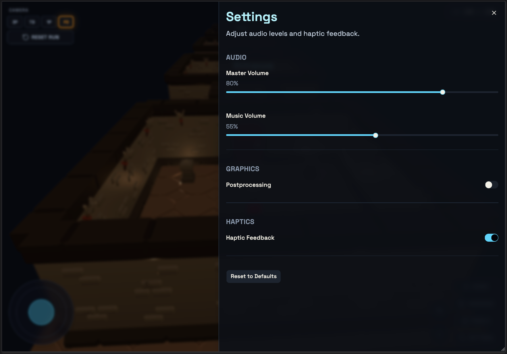</td>
  </tr>
  <tr>
    <td align="center"><em>Convex Sync: Real-time high-score updates</em></td>
    <td align="center"><em>Drawer Control: Interactive runtime settings</em></td>
  </tr>
</table>

---

## Technical Stack & Infrastructure

| Category | Technology | Architectural Purpose |
| :--- | :--- | :--- |
| **Orchestrator** | TanStack Start (React 19 + Vite) | Full-stack server routing and streaming hydration |
| **State Engine** | XState v5 | Authoritative statecharts, guard checks, and message queues |
| **3D & Physics** | React Three Fiber + Rapier | WebGL context, physics parameters, and collider sensors |
| **Visualizer** | `@xyflow/react` + `@dagrejs/dagre` | Interactive state chart node generation and layout routing |
| **Sync Database**| Convex (Self-Hosted) | Real-time scoreboards and persistent user profile storage |
| **Audio Pipeline**| Tone.js + Howler + Web Haptics | Contextual environmental sound synthesis and haptic cues |
| **Design System**| Tailwind CSS v4 | High-performance styling and responsive grid layouts |

---

## Getting Started

### Prerequisites
* Node.js `>=22.12.0` (Verify using `nvm use` or `node -v`)
* A running Convex local deployment

### Installation
```bash
npm install
npx convex dev --once
npm run dev
```
Open [http://localhost:3000](http://localhost:3000) to launch the sandbox.

---

## Developer Scripts

```bash
npm run dev           # Start local WebGL development server
npm run build         # Compile production bundles
npm run typecheck     # Validate TypeScript static analysis
npm run lint          # Run Biome code quality audit
npm run lint:fix      # Automatically fix Biome formatting and lint issues
npm run lint:fsd      # Verify Feature-Sliced Design bounds (Steiger)
npm run lint:structure # Validate structural conventions
npm run test          # Execute Vitest suite
npm run ci:local      # Execute full local CI quality gates
```

---

## Conceptual Intent & Core Purpose

Runestone is not a commercial gaming product, nor is it designed to compete with standard 3D action-adventure titles. Rather, it is a deliberate, highly visible **software engineering sandbox**. 

Its purpose is to serve as an interactive model for testing structural architecture paradigms in modern web engineering:
* **Demystifying Statecharts**: Proving that complex logic structures (like concurrent actors and nested state transition trees) can be made completely clear and auditable through spatial UI visualizations.
* **Validating Async Syncing**: Providing a live canvas to test fast client-server synchronization, offline state recovery, and distributed data engines like Convex.
* **Demonstrating AI-Native Pipelines**: Showcasing how strict automated testing (TDD), precise coding specifications (SDD), and automated linting/architecture gates can allow autonomous coding agents and human developers to collaborate safely without introducing regressions.
