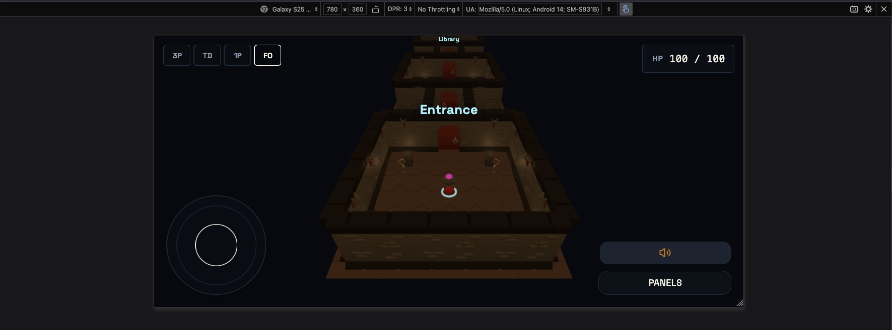
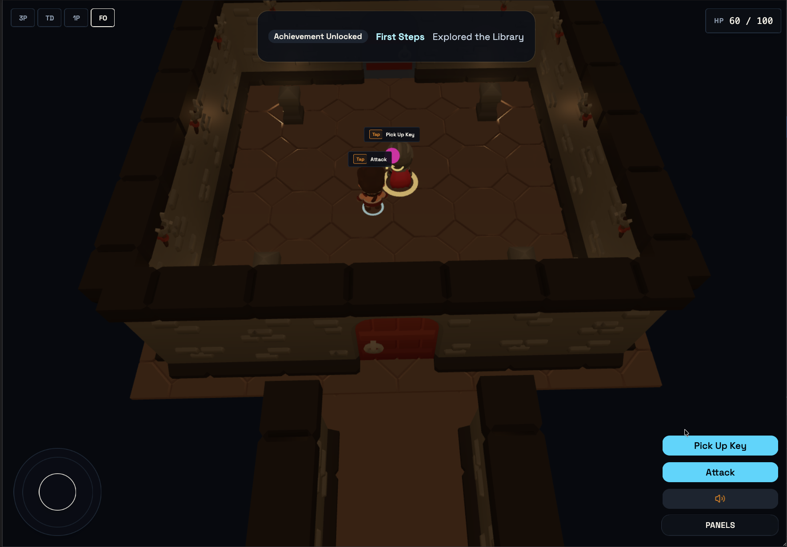
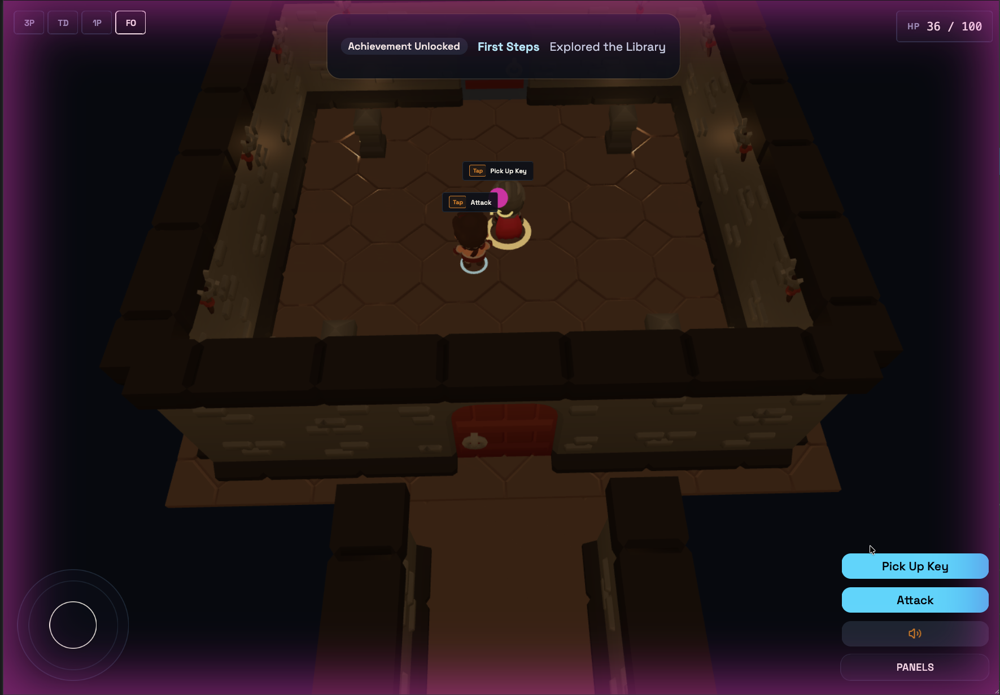
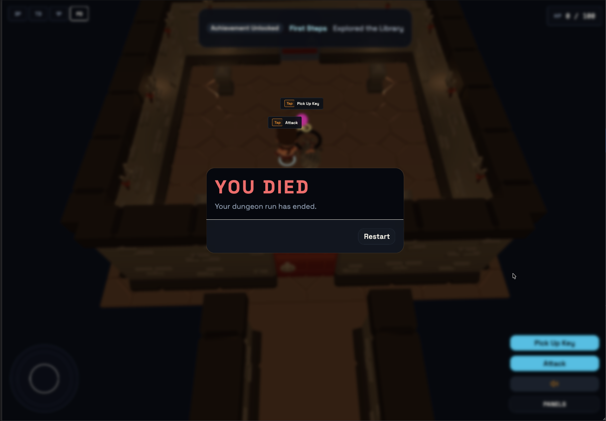
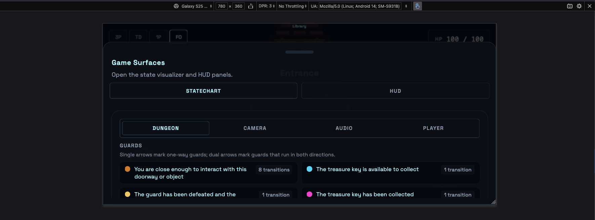
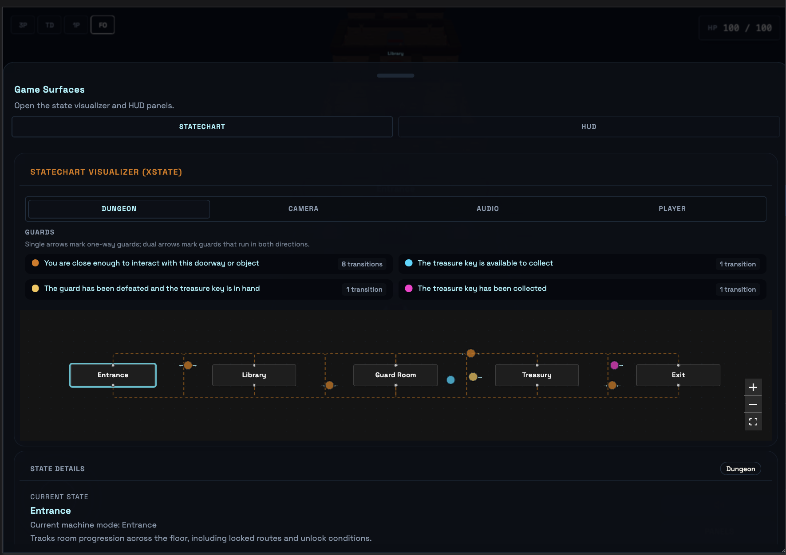
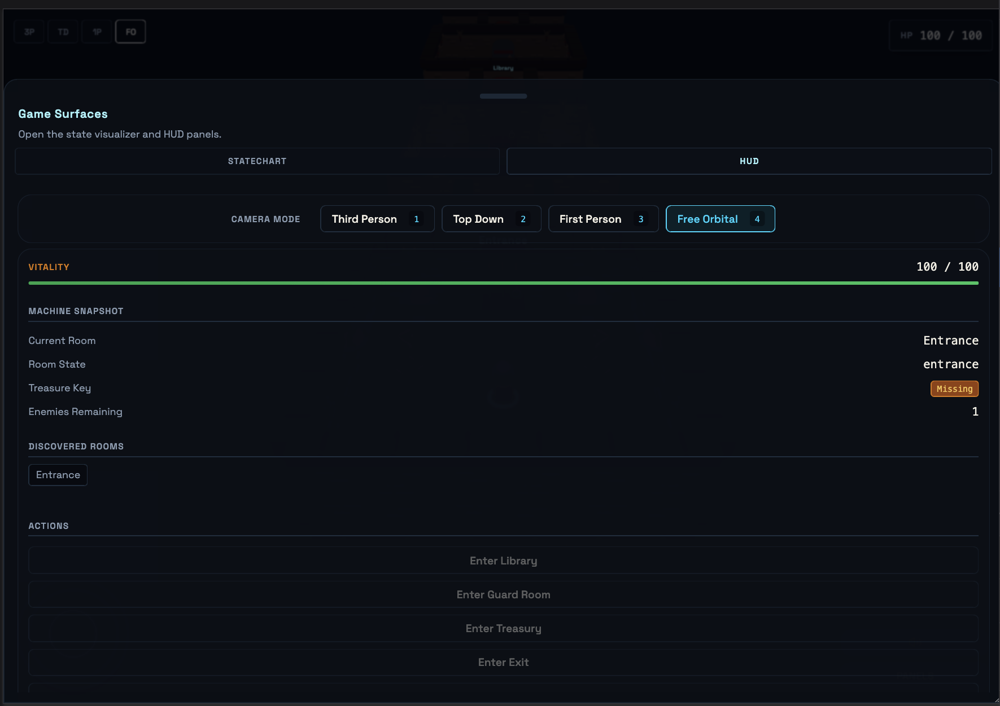

# Runestone

Runestone is a 3D dungeon crawler where the dungeon itself is an executable state machine. Rooms are states, doors are transitions, rune locks are guards, and enemy behavior is actor-driven runtime logic.

This is an engineering-first game prototype: the machine is not hidden in the codebase, it is visible in the level.

**[🏰 Enter the Dungeon](https://runestone.teeldinho.com)**


---

## Methodology

Runestone is developed as an engineering-first project, defined by a rigorous lifecycle that prioritizes predictability and correctness. We employ two core disciplines to ensure architectural integrity:

### Spec-Driven Development (SDD)

Every non-trivial feature begins with a **Project Brief** documenting its scope, technical constraints, and success criteria. By defining the problem space before writing code, we ensuring that every implementation is intentional and mapped to a documented requirement. This practice effectively eliminates feature creep and significantly reduces long-term technical debt.

### Test-Driven Development (TDD)

The codebase is governed by a strict **Red-Green-Refactor** cycle. We author failing tests to define a component's contract before implementation begins, ensuring 100% logic coverage for our critical `model/` and `lib/` layers. This provides a robust safety net, allowing for complex refactors of state machines and physics logic with absolute confidence in system stability.


---


## Finite State Machines

A **Finite State Machine (FSM)** models a system as a finite set of states with explicit transitions between them. At any moment, the system is in exactly one state.

This is useful because behavior becomes auditable instead of implicit. You can answer: where am I, why did I transition, and what must be true before the next transition.

---

## Why XState Here

Runestone uses XState to make behavior explicit, inspectable, and testable in-game, and the same model applies cleanly to many production software domains.

### Game Entity AI

Game artificial intelligence (AI) becomes easier to reason about when every behavior is an explicit state. Instead of ad hoc logic spread across updates, states such as idle, patrol, detect, chase, attack, and dead become a visible contract, with transitions that are intentional and debuggable. In Runestone, each enemy can run as its own actor, which keeps behavior deterministic as the game scales.

### Workflow Automation

Multi-step workflows like onboarding, approvals, and internal review chains often become hard to maintain when built with scattered booleans and nested conditionals. A state machine models each step as a state and each user/system event as a transition, so adding or reordering steps is a structural change rather than risky logic surgery across multiple files.

### Media Processing Pipelines

Media systems naturally move through discrete phases: upload, queue, process, transcode, generate thumbnails, publish, or fail. Each phase has different rules, data, and recovery paths, which makes implicit flow logic fragile over time. XState makes these phases explicit and provides a clear place for retries, timeouts, and fallback behavior.

### IoT and Hardware Communication

Hardware integrations are inherently stateful: scanning, connecting, connected, reconnecting, and failed all require different behavior. Without a formal state model, reconnect loops and edge cases become difficult to test and reproduce. XState provides an explicit lifecycle that improves reliability and simplifies diagnosing real-world device and network instability.

### Distributed Transaction Orchestration (Sagas)

When a business operation spans services (for example inventory, payment, and shipment), partial failure is expected and must be handled deliberately. State machines model both forward steps and compensation paths, making rollback behavior explicit instead of buried in exception branches. This is especially useful when consistency and auditability matter across service boundaries.

### Real-Time Connections

Real-time channels such as WebSocket and Server-Sent Events (SSE) require precise lifecycle handling: connecting, connected, reconnecting, backoff, and terminal failure. XState centralizes that lifecycle into one contract so transport behavior and user interface (UI) feedback stay in sync. The result is more predictable reconnect behavior, clearer observability, and less duplicated retry logic.

---

## How Runestone Maps to XState

| XState Concept | Runestone Equivalent |
| --- | --- |
| State | Room (`Entrance`, `Library`, `Guard Room`, `Treasury`, `Exit`) |
| Transition | Doorway/corridor between rooms |
| Guard | Rune lock (`hasKey`, `enemiesDefeated`) |
| Context | Inventory, health points (HP), score, discovered rooms |
| Entry Action | Audio cue, haptic pulse, scene updates |
| Invoked Actor | Enemy AI machine |
| Final State | Exit chamber (floor complete) |

---

## Interface Tour

### Desktop (three-pane workflow)

When you see the left pane, bottom pane, and right pane together with no joystick or `PANELS` trigger, that is the desktop layout.

<table>
  <tr>
    <td></td>
    <td></td>
  </tr>
  <tr>
    <td align="center"><em>Left pane: statechart visualizer and guard legend</em></td>
    <td align="center"><em>Right pane: machine snapshot, discovered rooms, actions</em></td>
  </tr>
</table>


### Mobile and Tablet (touch-first flow)

Portrait mode is blocked for gameplay and prompts a rotate notice:


Landscape gameplay keeps core controls visible (movement joystick, quick actions, and panel trigger):

<table>
  <tr>
    <td></td>
    <td></td>
  </tr>
  <tr>
    <td align="center"><em>Base landscape heads-up display (HUD) with `PANELS` trigger</em></td>
    <td align="center"><em>Combat interactions and action buttons</em></td>
  </tr>
</table>

<table>
  <tr>
    <td></td>
    <td></td>
  </tr>
  <tr>
    <td align="center"><em>Damage feedback during combat</em></td>
    <td align="center"><em>Death state with restart modal</em></td>
  </tr>
</table>

Panel surfaces scale from quick sheet to full sheet:

<table>
  <tr>
    <td></td>
    <td></td>
    <td></td>
  </tr>
  <tr>
    <td align="center"><em>Quick sheet preview</em></td>
    <td align="center"><em>Expanded Statechart view</em></td>
    <td align="center"><em>Expanded HUD view</em></td>
  </tr>
</table>

---

## Phase 1 Scope

Single-floor dungeon progression:

```text
Entrance -> Library -> Guard Room -> Treasury -> Exit
```

Implemented systems:

- 3D dungeon scene with KayKit assets and atmospheric fog
- Four camera modes (third-person, top-down, first-person, free-orbital)
- Machine-authoritative room traversal with doorway-relative arrival
- Live XState inspector (React Flow + dagre)
- Player movement, collision physics (Rapier), health points (HP), death, and restart loop
- Guard-room enemy behavior and treasury key progression
- Convex-backed auth and leaderboard flow
- Audio (Tone.js, Howler) and Web Haptics integration

---

## Architecture

Runestone follows **Feature-Sliced Design (FSD)** to keep imports and responsibilities explicit.

| Layer | Responsibility |
| --- | --- |
| `app/` | Providers, router, root wiring |
| `pages/` | Route composition |
| `widgets/` | Game canvas, heads-up display (HUD), inspector panel |
| `features/` | Camera, auth, audio, haptics, traversal |
| `entities/` | Player, enemy, room, dungeon, score |
| `shared/` | Reusable UI, config, types, infrastructure |

Slice flow:

```text
ui/ -> model/ -> lib/ -> config/
```

---

## Technical Stack

| Component | Technology |
| --- | --- |
| Framework | TanStack Start + React 19 |
| 3D Engine | React Three Fiber + Rapier |
| State Management | XState v5 (actor model) |
| Backend | Convex (real-time) |
| Audio | Tone.js + Howler |
| Haptics | Web Haptics API |
| Visualizer | React Flow + dagre |
| Styling | Tailwind CSS v4 + Class Variance Authority (CVA) |

---

## The Backend: Self-Hosted Convex

Our persistent data, state synchronization, and live leaderboards are powered by [Convex](https://convex.dev/). While Convex provides an excellent managed cloud service, we deliberately **self-hosted** our Convex backend.

**Why self-host?**
- **Infrastructure Autonomy**: By running it ourselves, we validate that the application logic does not implicitly depend on a proprietary cloud black-box. We own our data, our deployment pipeline, and our runtime environment entirely.
- **Type-Safe Velocity**: Leveraging Convex allows us to write backend mutations and queries in the exact same TypeScript ecosystem as our frontend. With end-to-end type safety, deploying real-time systems (like our live leaderboard) requires significantly less boilerplate compared to traditional REST or GraphQL architectures.

---

## Outstanding Features

Runestone is an expanding foundation. The architecture supports rapid iteration, and our roadmap includes the following ambitious milestones:

- **Procedural Dungeon Generation**: Leveraging our explicit XState room nodes to generate randomized, yet resolvable, floor layouts.
- **Deeper Enemy State Trees**: Introducing complex "Patrol" and "Heal/Flee" states to adversaries, pushing the limits of actor-driven logic.
- **Inventory & Loot Persistence**: Securely stashing obtained gear within the Convex backend to load seamlessly when crossing new dungeon borders.

---

## Camera Modes

| Mode | Hotkey | Description |
| --- | --- | --- |
| Third Person | `1` | Offset behind player, constrained orbit |
| Top Down | `2` | Fixed overhead angle, zoom only |
| First Person | `3` | Head-level view with pointer lock |
| Free Orbital | `4` | Pan + rotate + zoom |

---

## Getting Started

### Prerequisites

- Node.js >= 22.12.0 (`nvm use`)
- Convex account (free tier is enough)

### Install and Run

```bash
npm install
npx convex dev --once
npm run dev
```

Open [http://localhost:3000](http://localhost:3000). On first visit, enter a username to start.

---

## Scripts

```bash
npm run dev           # Start dev server
npm run build         # Production build
npm run typecheck     # TypeScript validation
npm run lint          # Biome check
npm run lint:fix      # Biome auto-fix
npm run lint:fsd      # FSD architecture validation
npm run test          # Vitest test suite
npm run ci:local      # Full local CI check
```

---

## Final Note

Runestone is an engineering experiment with production-grade guardrails.

The goal is not to ship a commercial game; it is to explore what software feels like when the state machine is the product, not hidden plumbing.
