# Runestone

Runestone is a 3D exploration of **manifest logic**: a dungeon crawler that turns Finite State Machines into a navigable, inspectable world. Rooms represent states, corridors represent explicit transitions, and progression is governed by guards, context, and actor-driven behavior rather than hidden control flow.

The project is intentionally both **playable** and **architectural**. It explores how event-driven systems, state machines, physics, agent-native engineering practices, and real-time 3D interaction can work together without collapsing into ad hoc runtime logic. The result is a small game world that doubles as a visual argument for deliberate software design.

**[🏰 Enter the Dungeon - Play Now!](https://runestone.teeldinho.com)**

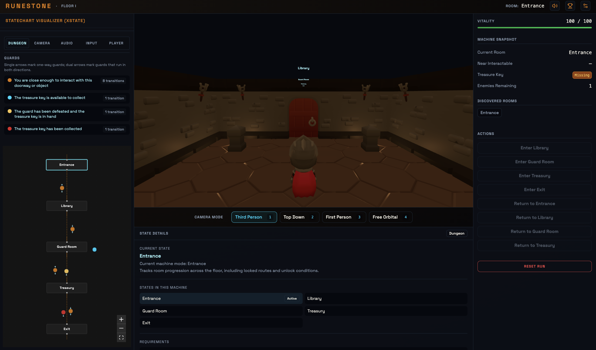

---

## Methodology

The development of Runestone is guided by a formal lifecycle focused on systemic reliability. We prioritize architectural correctness over rapid prototyping and use controlled engineering loops so that requirements, implementation, verification, and handoff context remain auditable.

### Spec-Driven Development (SDD)

**Spec-Driven Development** is the engineering practice of formalizing a feature's blueprint before implementation begins.

- **The Concept**: A discipline of articulating constraints, risks, edge cases, and success criteria as a prerequisite for implementation.
- **The Practice in Runestone**: We keep implementation-loop artifacts in a local, non-committed hidden workspace that persists between agent sessions. These artifacts capture feature specs, acceptance criteria, decision trails, review findings, implementation notes, and verification outcomes without polluting source control.
- **Why This Matters**: Persistent loop artifacts help preserve context across long-running agent workflows, reduce avoidable rediscovery, protect limited context windows, and give both humans and agents a stable source of truth during iterative refinement.
- **The Inspiration**: This approach is influenced by recursive agent-loop thinking often discussed through the **Ralph Wiggum loop** shorthand, but Runestone applies that idea with stronger engineering controls: explicit specifications, deliberate review points, local verification, and clear stopping conditions.
- **The Outcome**: Systems that are more likely to converge cleanly, with less logic drift, fewer repeated mistakes, and a clearer audit trail for why a solution exists.

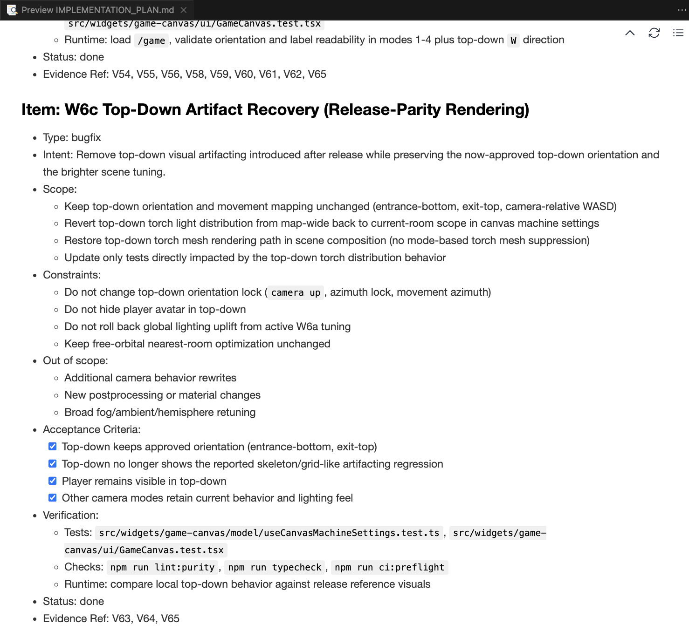

### Test-Driven Development (TDD)

**Test-Driven Development** is a verification-first cycle where functional contracts are drafted through tests before implementation logic is authored.

- **The Concept**: Defining a component's behavioral contract through failing tests using the Red-Green-Refactor cycle.
- **Technical Justification**: Writing tests first forces the design of cleaner, decoupled APIs. It ensures that our model hooks are built for testability and that business logic is never implicitly coupled to the UI layer.
- **The Outcome**: Produces a self-documenting test suite that proves the engine's correctness at every commit, transforming "working code" from an assumption into a verified standard.

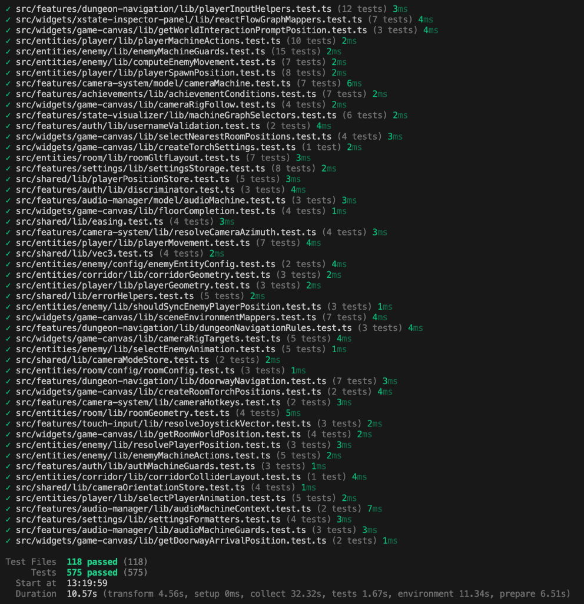

### Local CI and Reversible Delivery

Runestone treats “ready for review” as a locally proven state. Work is scoped in the agent-native loop, implemented in small reversible commits, and checked against the repository’s quality gates before it is handed off.

That means we use local validation to catch formatting, architecture, type, and test regressions at the branch level, while the loop artifacts keep the implementation intent, verification notes, and outstanding decisions auditable between sessions.

We prefer this over a post-hoc scramble because it keeps review focused on design and correctness instead of avoidable validation misses.

---

## Finite State Machines

A **Finite State Machine (FSM)** models a system as a finite set of states with explicit transitions between them. At any moment, the system is in exactly one state.

This is useful because behavior becomes auditable instead of implicit. You can answer: where am I, why did I transition, and what must be true before the next transition.

---

## Why XState Here

Runestone uses XState to make behavior explicit, inspectable, and testable in-game, and the same model applies cleanly to many production software domains. Here are a few use cases:

### Game Entity AI

Game artificial intelligence (AI) becomes easier to reason about when every behavior is an explicit state. Instead of ad hoc logic spread across updates, states such as idle, patrol, detect, chase, attack, and dead become a visible contract, with transitions that are intentional and debuggable. In Runestone, each enemy can run as its own actor, which keeps behavior deterministic as the game scales.

### Workflow Automation

Multi-step workflows like onboarding, approvals, and internal review chains often become hard to maintain when built with scattered booleans and nested conditionals. A state machine models each step as a state and each user/system event as a transition, so adding or reordering steps is a structural change rather than risky logic surgery across multiple files.

### Media Processing Pipelines

Media systems naturally move through discrete phases: upload, queue, process, transcode, generate thumbnails, publish, or fail. Each phase has different rules, data, and recovery paths, which makes implicit flow logic fragile over time. XState makes these phases explicit and provides a clear place for retries, timeouts, and fallback behavior.

### IoT and Hardware Communication

Hardware integrations are inherently stateful: scanning, connecting, connected, reconnecting, and failed all require different behavior. Without a formal state model, reconnect loops and edge cases become difficult to test and reproduce. XState provides an explicit lifecycle that improves reliability and simplifies diagnosing real-world device and network instability.

### Distributed Transaction Orchestration (Sagas)

When a business operation spans services (for example inventory, payment, and shipment), partial failure is expected and must be handled deliberately. State machines model both forward steps and compensation paths, making rollback behavior explicit instead of buried in exception branches. This is especially useful when consistency and auditability matter across service boundaries.

### Real-Time Connections

Real-time channels such as WebSocket and Server-Sent Events (SSE) require precise lifecycle handling: connecting, connected, reconnecting, backoff, and terminal failure. XState centralizes that lifecycle into one contract so transport behavior and user interface (UI) feedback stay in sync. The result is more predictable reconnect behavior, clearer observability, and less duplicated retry logic.

---

## How Runestone Maps to XState

| XState Concept | Runestone Equivalent |
| --- | --- |
| State | Room (`Entrance`, `Library`, `Guard Room`, `Treasury`, `Exit`) |
| Transition | Doorway/corridor between rooms |
| Guard | Rune lock (`hasKey`, `enemiesDefeated`) |
| Context | Inventory, health points (HP), score, discovered rooms |
| Entry Action | Audio cue, haptic pulse, scene updates |
| Invoked Actor | Enemy AI machine |
| Final State | Exit chamber (floor complete) |

---

## The Actor Model Engine: Core State Machines

Runestone behavior is grounded in the **actor model**, where every major system operates as a self-contained, auditable event loop. By literalizing these logic units into finite state machines, we ensure that every transition in the dungeon, the player’s behavior, or the camera mode is a deliberate structural shift rather than a cascading side effect.

### Spatial Logic: The Dungeon Machine

Manages the physical state of the dungeon. It tracks which rooms are "active," handles the logic of moving between areas, and acts as a gatekeeper for progress—locking doorways until specific criteria, such as defeating guards or collecting keys, are met.

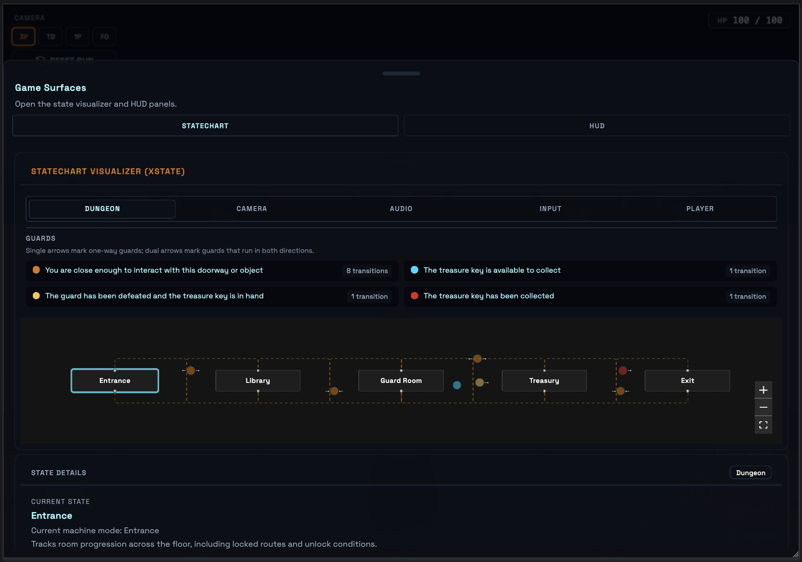

### Perspectives: The Camera Machine

Defines which view mode is active — **First-Person (1P)**, **Third-Person (3P)**, **Top-Down (TD)**, or **Free Orbital (FO)** — and keeps those transitions explicit, inspectable, and testable through XState.

Continuous camera motion is handled by Drei `CameraControls`, which owns live rotation, zoom, follow behavior, and smooth target updates without feeding transient runtime telemetry back into the machine. This keeps the camera state model simple while avoiding control loops between player movement and camera interaction.

Mode switches preserve the player’s world-facing look direction where the destination camera mode allows it, so changing perspective does not unexpectedly reset orientation.

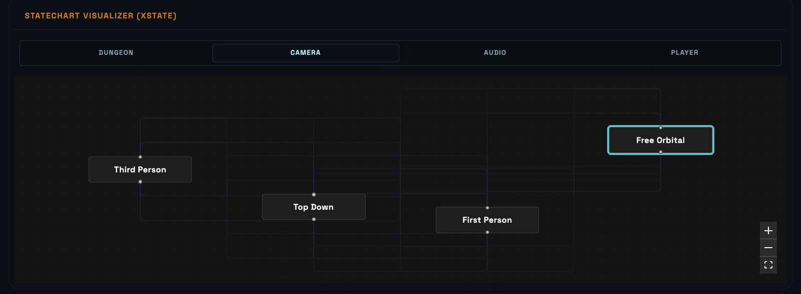

### Input Orchestration: Movement, Actions, and Touch Semantics

Runestone routes gameplay intent through a dedicated input orchestration layer before it reaches the player or dungeon systems. Keyboard and touch input converge through the same event-driven flow, which standardizes:

- movement vectors,
- desktop run hold and mobile Run toggle behavior,
- Jump events,
- contextual Attack / Interact actions,
- pointer ownership around mobile controls.

This keeps UI surfaces lightweight while ensuring that player and interaction machines receive consistent domain events regardless of device.

### Atmosphere: The Audio Machine

Handles the global sound environment using the actor model to track the audio lifecycle through **Paused**, **Playing**, and **Muted** states. This provides a centralized point for managing volume transitions and ensuring audio persistence across scene loads.

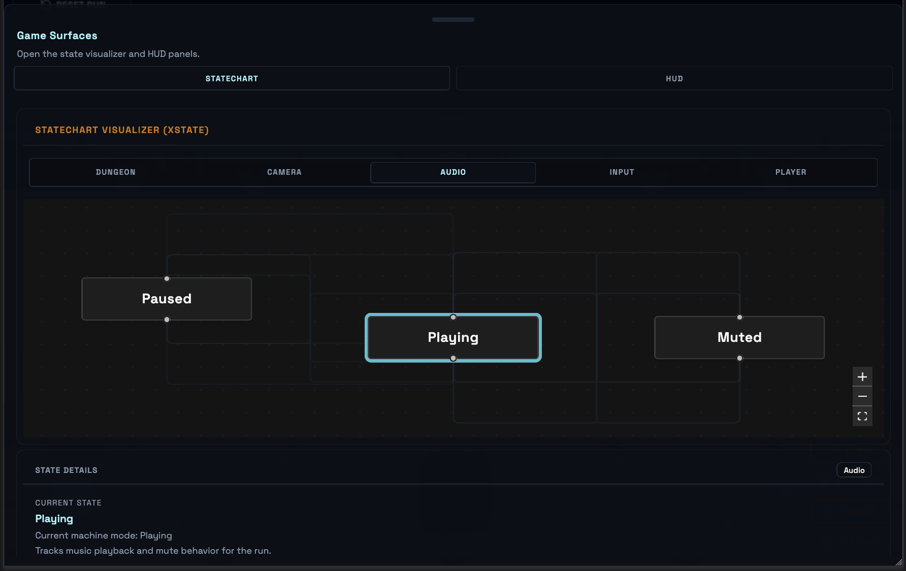

### Vitality & Movement: The Player Machine

Orchestrates the explorer’s runtime through parallel behavioral concerns. It manages locomotion states such as **Idle**, **Walking**, and **Running**, tracks vitality through **Healthy**, **Damaged**, and **Dead**, and models grounded versus airborne behavior to support Jump and landing flow without burying those rules in UI code.

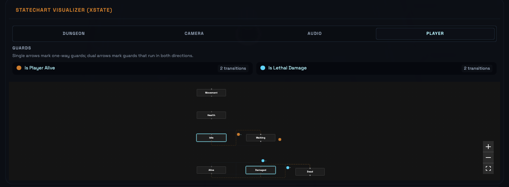

--- 

## Interface Tour

### Desktop (three-pane workflow)

When you see the left pane, bottom pane, and right pane together with no joystick or `PANELS` trigger, that is the desktop layout.

<table>
  <tr>
    <td>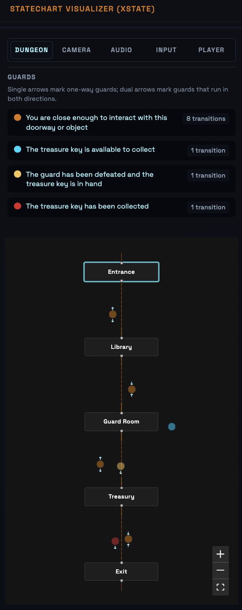</td>
    <td>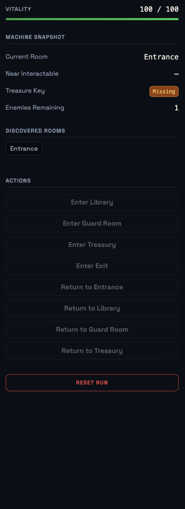</td>
  </tr>
  <tr>
    <td align="center"><em>Left pane: statechart visualizer and guard legend</em></td>
    <td align="center"><em>Right pane: machine snapshot, discovered rooms, actions</em></td>
  </tr>
</table>

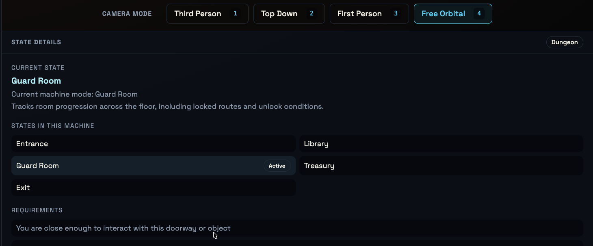

### Mobile and Tablet Interaction

Runestone strictly enforces a landscape gameplay environment for optimal 3D spatial control. The interface scales between compact mobile handsets and larger tablet displays while preserving a consistent interaction model:

- **Left-side joystick** for player movement
- **Scene-wide look surface** for camera rotation outside interactive overlays
- **Run** and **Jump** action buttons for mobile play
- **Contextual Attack / Interact** actions when the player is near relevant dungeon entities
- **Mobile HUD** controls optimized for reachability and viewport visibility
- **Tablet HUD** treatments that use additional space for clearer labels and action affordances

Pointer ownership and layered input boundaries prevent the joystick, action buttons, and camera surface from competing for the same touch gesture. This keeps simultaneous **Move + Look** interaction stable and predictable on mobile/tablet devices.

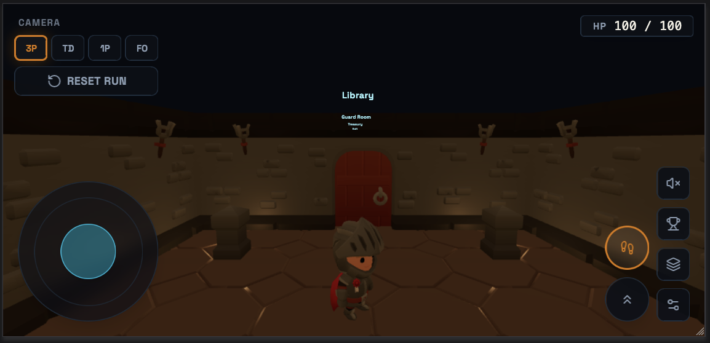
<p align="center"><em>Compact mobile gameplay with joystick movement, camera look space, and action controls</em></p>

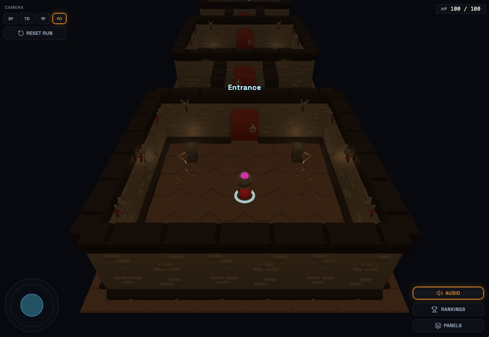
<p align="center"><em>Tablet gameplay layout with expanded controls and clearer tactical affordances</em></p>

### Combat and Resilience

The player actor handles interaction prompts and resilience feedback through explicit state changes, showcased here in the expanded tablet perspective:

<table>
  <tr>
    <td>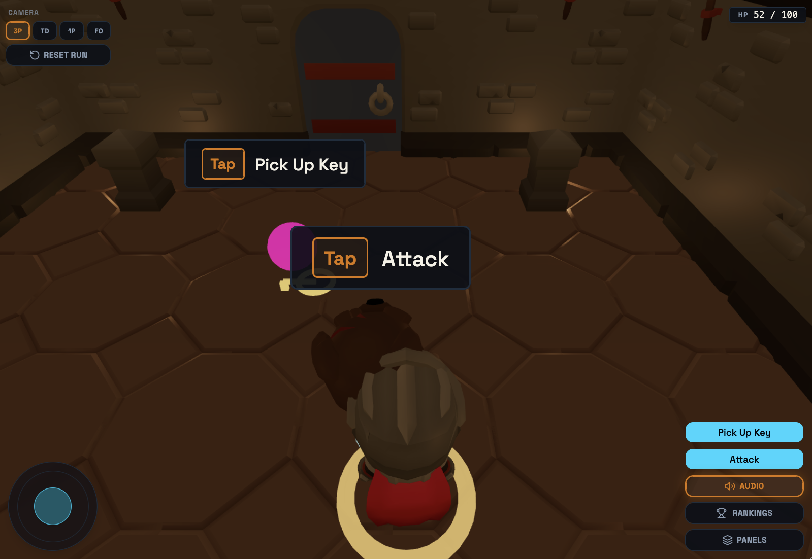</td>
    <td>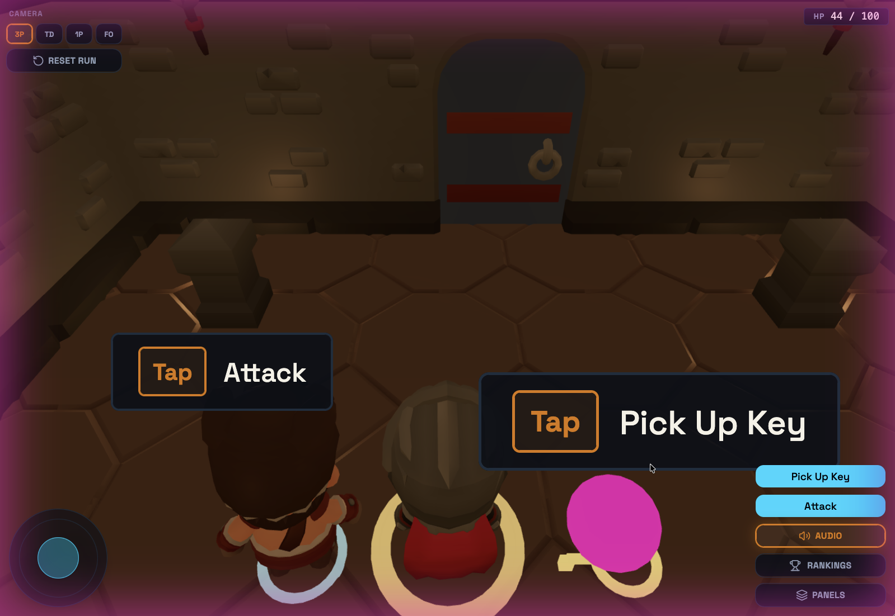</td>
  </tr>
  <tr>
    <td align="center"><em>Contextual interaction prompts (Attack/Pick Up Key)</em></td>
    <td align="center"><em>Visual damage feedback vignette</em></td>
  </tr>
</table>

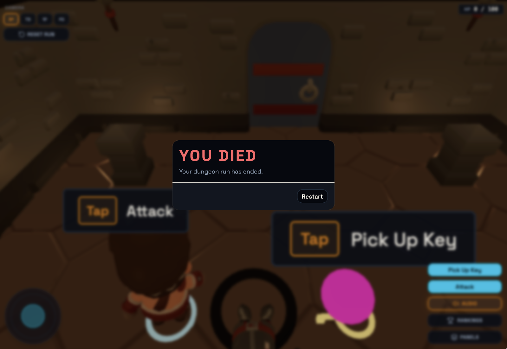
<p align="center"><em>The 'YOU DIED' termination state with restart loop (Tablet view)</em></p>

### Camera Mode Showcase

Perspective switching is driven by the camera mode state machine, while live camera motion is handled through Drei `CameraControls`. This separation preserves inspectable mode transitions without sacrificing stable runtime behavior during movement, look input, zoom, or camera-mode changes.

#### Camera Modes

| Mode | Hotkey | Description |
| --- | --- | --- |
| **Third-Person (3P)** | `1` | Offset follow view with constrained orbit |
| **Top-Down (TD)** | `2` | Fixed overhead perspective with controlled zoom |
| **First-Person (1P)** | `3` | Head-level view with direct look control |
| **Free Orbital (FO)** | `4` | Pan, rotate, and zoom exploration camera |

Mode changes preserve the player’s world-facing look direction where the destination camera constraints allow it. Switching from one perspective to another should feel like changing vantage point, not losing orientation.

#### Perspectives

<table>
  <tr>
    <td>
      <h5>Third Person (3P):</h5>
      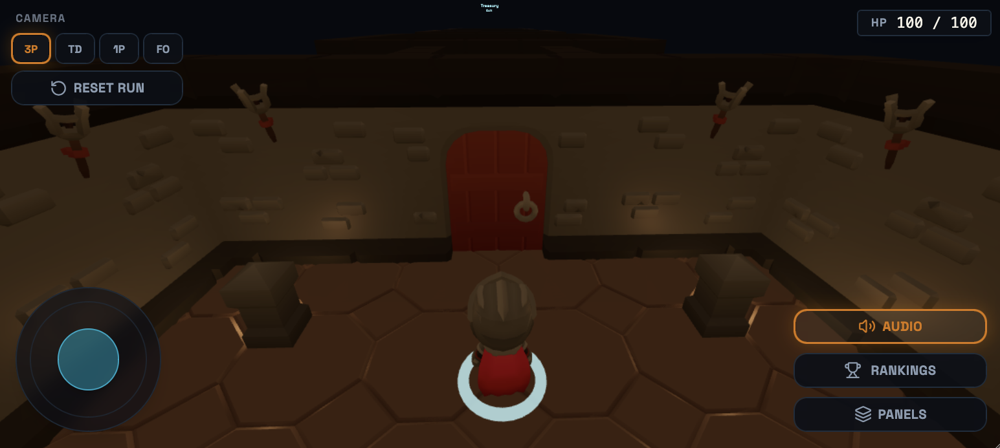
    </td>
    <td>
      <h5>Top Down (TD):</h5>
      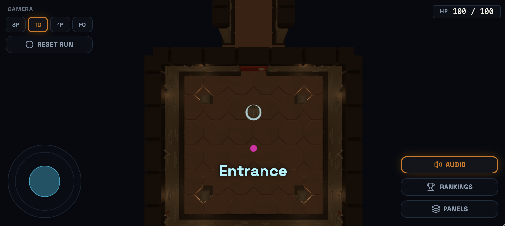
    </td>
  </tr>
  <tr>
    <td>
      <h5>First Person (1P):</h5>
      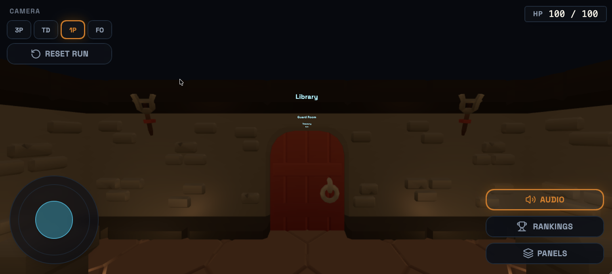
    </td>
    <td>
      <h5>Free Orbital (FO):</h5>
      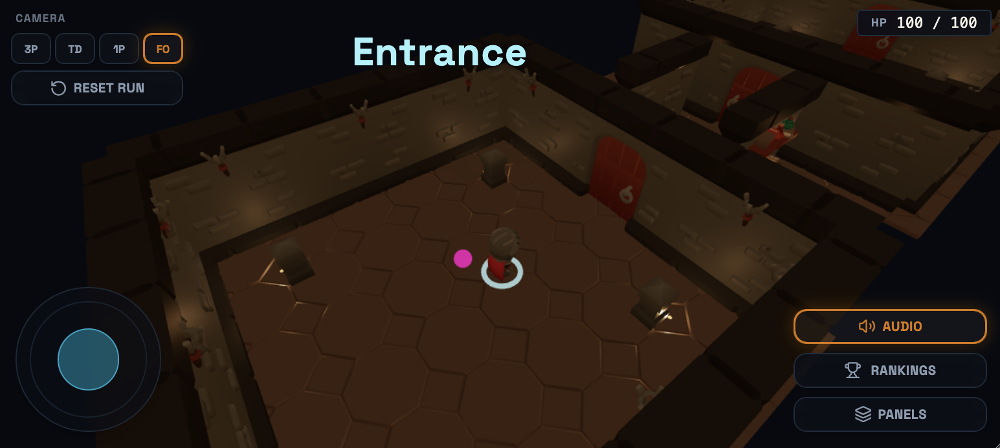
    </td>
  </tr>
</table>

---

## Phase 1 Scope

Single-floor dungeon progression:

```text
Entrance -> Library -> Guard Room -> Treasury -> Exit
```

Implemented systems:

- 3D dungeon scene with KayKit assets and atmospheric fog
- Four camera modes (third-person, top-down, first-person, free-orbital)
- CameraControls-based camera runtime that decouples follow movement from live camera interaction
- Look-direction continuity across camera-mode switches
- Mobile/tablet control model with joystick movement, scene-wide look interaction, Run, Jump, and contextual action buttons
- Machine-authoritative room traversal with doorway-relative arrival
- Live XState inspector (React Flow + dagre)
- Player movement, collision physics (Rapier), airborne/grounded behavior, health points (HP), death, and restart loop
- Guard-room enemy behavior and treasury key progression
- Convex-backed auth and leaderboard flow
- Audio (Tone.js, Howler) and Web Haptics integration

---

## Architecture

Runestone follows **Feature-Sliced Design (FSD)** to keep imports and responsibilities explicit.

| Layer | Responsibility |
| --- | --- |
| `app/` | Providers, router, root wiring |
| `pages/` | Route composition |
| `widgets/` | Game canvas, heads-up display (HUD), inspector panel |
| `features/` | Camera, input orchestration, auth, audio, haptics, traversal |
| `entities/` | Player, enemy, room, dungeon, score |
| `shared/` | Reusable UI, config, types, infrastructure |

Slice flow:

```text
ui/ -> model/ -> lib/ -> config/
```

### Runtime Ownership Boundaries

Runestone uses state machines where explicit transitions and event contracts improve clarity, while leaving highly continuous runtime concerns to specialized libraries built for them.

| Concern | Primary Owner |
| --- | --- |
| Camera mode semantics | XState camera machine |
| Continuous camera rotation, zoom, and follow behavior | Drei `CameraControls` |
| Movement, Run, Jump, and action routing | Input orchestrator |
| Player locomotion and airborne state | Player machine + physics hooks |
| Contextual dungeon interactions | Dungeon/navigation machine |

---

## Technical Stack

| Component | Technology |
| --- | --- |
| Framework | TanStack Start + React 19 |
| 3D Engine | React Three Fiber + Drei CameraControls + Rapier |
| State Management | XState v5 actor model for gameplay modes, orchestration, and inspectable transitions |
| Backend | Convex (real-time) |
| Audio | Tone.js + Howler |
| Haptics | Web Haptics API |
| Visualizer | React Flow + dagre |
| Styling | Tailwind CSS v4 + Class Variance Authority (CVA) |

---

## The Backend: Self-Hosted Convex

Our persistent data, state synchronization, and live leaderboards are powered by [Convex](https://convex.dev/). While Convex provides an excellent managed cloud service, we deliberately **self-hosted** our Convex backend.

**Why self-host?**
- **Infrastructure Autonomy**: By running it ourselves, we validate that the application logic does not implicitly depend on a proprietary cloud black-box. We own our data, our deployment pipeline, and our runtime environment entirely.
- **Type-Safe Velocity**: Leveraging Convex allows us to write backend mutations and queries in the exact same TypeScript ecosystem as our frontend. With end-to-end type safety, deploying real-time systems (like our live leaderboard) requires significantly less boilerplate compared to traditional REST or GraphQL architectures.

---

## Outstanding Features

Runestone is an expanding foundation. The architecture supports rapid iteration, and our roadmap includes the following ambitious milestones:

- **Procedural Dungeon Generation**: Leveraging our explicit XState room nodes to generate randomized, yet resolvable, floor layouts.
- **Deeper Enemy State Trees**: Introducing complex "Patrol" and "Heal/Flee" states to adversaries, pushing the limits of actor-driven logic.
- **Inventory & Loot Persistence**: Securely stashing obtained gear within the Convex backend to load seamlessly when crossing new dungeon borders.

---

## Getting Started

### Prerequisites

- Node.js >= 22.12.0 (`nvm use`)
- Convex account (free tier is enough)

### Install and Run

```bash
npm install
npx convex dev --once
npm run dev
```

Open [http://localhost:3000](http://localhost:3000). On first visit, enter a username to start.

---

## Scripts

```bash
npm run dev           # Start dev server
npm run build         # Production build
npm run typecheck     # TypeScript validation
npm run lint          # Biome check
npm run lint:fix      # Biome auto-fix
npm run lint:fsd      # FSD architecture validation
npm run test          # Vitest test suite
npm run ci:local      # Full local CI check
```

---

## Final Note

Runestone is an engineering experiment with production-grade guardrails.

The goal is not to ship a commercial game; it is to explore what software feels like when the state machine is visible, inspectable, and deliberately scoped — central where behavior benefits from explicit transitions, and restrained where specialized runtime systems should lead.
